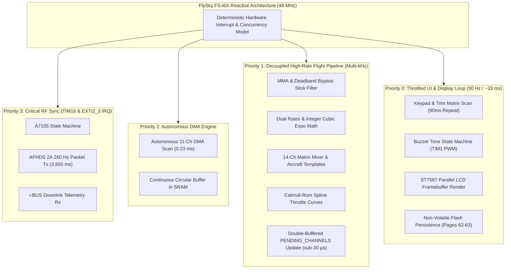

# flysky-i6x-rs

A minimalist, clean-slate RC transmitter firmware for the **FlySky FS-i6X**, written in `no_std` Rust.

Focused on the built-in **A7105** 2.4 GHz RF transceiver (**AFHDS2A** protocol), **i-BUS** telemetry, and the **128×64 LCD** interface.

---

## 1. Overview & Philosophy

The FS-i6X open-source journey was pioneered by the remarkable work of the [OpenI6X](https://github.com/OpenI6X/opentx) project, which successfully brought OpenTX/EdgeTX to this hardware and reverse-engineered the radio architecture.

`flysky-i6x-rs` explores a complementary design philosophy: an experimental, clean-slate firmware written in bare-metal `no_std` Rust designed with:
- **Zero-cost abstractions:** Microcontroller-native, static allocation, no heap allocations (`no_std`).
- **Hard Real-Time Concurrency:** Priority-driven hardware interrupt scheduling (`TIM16` 260 Hz packet sync, `EXTI2` RF ready) paired with a high-rate decoupled flight pipeline and throttled 30 Hz display loop.
- **Strict Scope:** Dedicated support for the built-in hardware (A7105 AFHDS2A + i-BUS), 4-axis gimbals, switches, trims, 20-model storage, 14-channel matrix mixer, and a 128×64 monochrome UI.
- **Lightweight Footprint:** **67.5 KB Flash** (leaving >58 KB free / 45.5% headroom) and **1.7 KB static RAM** + 1 KB LCD framebuffer (leaving >89% SRAM free).

---

## 2. Target Hardware Map (STM32F072VB)

| Peripheral | Controller / Spec | MCU Pins & Ports | Notes |
| :--- | :--- | :--- | :--- |
| **MCU** | STM32F072VB (Cortex-M0 @ 48 MHz) | ARMv6-M (`thumbv6m-none-eabi`) | 128 KB Flash, 16 KB SRAM |
| **RF Transceiver** | Amiccom **A7105** 2.4 GHz | **SPI1** + GPIOs | SPI1 (SCK, MOSI, MISO) |
| | Chip Select (CSN) | `PE12` (Active Low) | Fast GPIO output |
| | Antenna Switch | `PE10` (RF0), `PE11` (RF1) | Diversity / TR switch |
| | Packet Ready IRQ | `PB2` (EXTI2) | GIO2 line from A7105 (Tx/Rx done) |
| | RF Timer | `TIM16` | Periodic packet scheduling (~3.8ms–7.5ms) |
| **Display** | **ST7567** (128×64 Monochrome LCD) | 8-bit 6800 Parallel Bus | 1024-byte framebuffer in RAM; 30 Hz refresh (~33 ms); Electronic Volume (EV) contrast (15..55) |
| | Data Bus (D0..D7) | `PE0 .. PE7` | Full-byte ODR write (`GPIOE->ODR[7:0]`) |
| | Command/Data (RS) | `PB3` | Low = Command, High = Data |
| | Reset (RST) | `PB4` | Active Low hardware reset |
| | Read/Write (RW) | `PB5` | Kept Low for write mode |
| | Chip Select (CS) | `PD2` | Active Low (held Low for bus access) |
| | Strobe (RD / E) | `PD7` | 6800-series latch strobe (High -> Low pulse) |
| | Backlight (Stock) | `PF3` | **Active HIGH** (drives NPN transistor base) |
| | Backlight (Modded)| `PC9` | `TIM3_CH4` PWM dimming mod (pioneered by OpenI6X) |
| **Analog Inputs** | 12-bit ADC1 via DMA | 11 Channels scanned | Continuous circular DMA1 Ch1 buffer |
| | Sticks (RH, RV, LV, LH) | `PA0`, `PA1`, `PA2`, `PA3` | Channels 0 (Roll), 1 (Pitch), 2 (Thr), 3 (Yaw) |
| | Potentiometers (VRA, VRB)| `PA6`, `PA7` | Channels 6 (VR1 / Left), 7 (VR2 / Right) |
| | Switches (SA, SB, SC, SD)| `PA4`, `PA5`, `PB0`, `PB1` | Channels 4 (2-pos), 5 (3-pos), 8 (3-pos), 9 (2-pos) |
| | Battery Sense | `PC0` | Channel 10 (voltage divider: `(raw * 100) / 421 + 20`) |
| **Digital Keys** | 3 Columns × 4 Rows Matrix | Keypad & Trims | Polled at ~50–100 Hz |
| | Matrix Columns (R1..R3)| `PC6`, `PC7`, `PC8` | Driven Low sequentially |
| | Matrix Rows (L1..L4) | `PD12`, `PD13`, `PD14`, `PD15` | Inputs with internal pull-ups |
| | Inward Trim Keys | `PC6`+`PD13` & `PC7`+`PD14` | Roll Left (RHL) + Yaw Right (LHR) |
| | Dedicated Bind Key | `PF2` | Active Low (pull-up enabled) |
| **Storage** | On-chip Flash (Pages 62 & 63)| `0x0801_F000 .. 0x0801_FFFF` (4 KB) | 20 models + radio settings (2688 bytes) |
| **Telemetry / Serial**| UART Interfaces | `USART2` (PD5 Tx / PA15 Rx) | External telemetry / i-BUS mirror |
| **Audio** | Piezo Buzzer | `TIM1_CH1` (`PA8`) | Hardware PWM frequency & tone generator |

---

## 3. Software Architecture



### Key Libraries / Crates
- `cortex-m`, `cortex-m-rt`: Core ARM runtime and interrupt vector tables.
- `stm32f0xx-hal`: Embedded HAL implementation for STM32F0 peripherals.
- `embedded-graphics`: Monochrome UI primitive rendering, fonts, lines, and bitmaps.
- `embedded-hal`: Trait abstractions for SPI, I2C, and GPIO.

---

## 4. AFHDS2A & i-BUS Subsystem Design

### Frequency Hopping (FHSS)
AFHDS2A distributes transmission across 16 pseudo-random frequencies generated from the transmitter's unique silicon ID:
```
UID (at 0x1FFFF7AC) -> LCG Random Seed -> 16 Unique Channels (1..164 with min spacing >= 5)
```

### Packet Protocol
1. **Bind Packets (`0xBB` / `0xBC`):** Broadcasts TX ID and hopping table to allow receivers (e.g. FS-iA6B) to sync.
2. **Stick Data Packet (`0x58`):** 38-byte frame containing up to 14 channels encoded as microsecond pulses (1000–2000 µs).
3. **Settings Packet (`0xAA`):** Directs receiver output mode (PWM, PPM, i-BUS, or S.BUS).
4. **Telemetry Reception Window:** The transmitter switches the A7105 to RX immediately following packet transmission to receive i-BUS sensor telemetry frames (TX/RX voltage, RSSI, temperature, RPM, etc.).

---

## 5. Display & User Interface (128×64)

The ST7567 parallel LCD driver maintains a **1024-byte framebuffer** in SRAM (`128 * 64 / 8`). Updating the entire screen takes < 1.2 ms via direct 8-bit GPIO port writes (`GPIOE->ODR`).
- **Throttled Refresh Rate (30 Hz)**: Throttled via the hardware SysTick timer (`time::millis()`) to a steady 30 Hz (~33 ms). This completely decouples graphical drawing from the multi-kHz flight control loop, eliminating servo latency and stutter.
- **Electronic Volume (EV) Contrast Adjustment**: Digitally adjustable LCD contrast (`15..=55`, default 37 / `0x25`) in `Radio Setup` with instant live hardware preview and Flash persistence.
- **Multi-Page Flight Dashboard**: 4 switchable screens cycled by tapping `[BIND]`:
  1. **Page 1/4 (Gimbals & Trims)**: Live stick sliders, center markers, trim position ticks, and switch/pot readouts.
  2. **Page 2/4 (14-CH Dual Column Monitor)**: Simultaneous graphic bar indicators and exact microsecond pulse readouts across all 14 channels.
  3. **Page 3/4 (Model Dashboard)**: Full 10-character model name, aircraft type, bound receiver ID, throttle curve configuration, and telemetry status.
  4. **Page 4/4 (Telemetry Sensors)**: Dedicated diagnostics showing real-time RSSI, link state, packet odometer counters (`TX`/`RX`), battery voltages (`RX`/`TX`), and session extremes (`mRSS`/`mRX`).
- **Scrollable Menus**: Standardized 4-item scrollable viewports across all submenus with 9px row heights and auto-repeating navigation keys.

---

## 6. Project Documentation

Comprehensive technical documentation is maintained in the [`docs/`](docs/) directory:

- **[User Guide & Operations Manual](docs/USER_GUIDE.md)**: Complete operator guide covering flight dashboard, menu navigation, 20-model setup, throttle curves, calibration, and binding.
- **[System Architecture & Timing Model](docs/ARCHITECTURE.md)**: 48 MHz clock tree, real-time concurrency model, TIM16 260 Hz packet loop, Catmull-Rom curve math, and zero-heap memory layout.
- **[AFHDS 2A Protocol & A7105 RF Driver](docs/RF_PROTOCOL.md)**: SPI1 hardware driver, 16-channel FHSS hopping table, 38-byte packet structure, Model Match, and one-way/two-way receiver binding.
- **[Flight Inputs & Digital Trims](docs/INPUT_SUBSYSTEM.md)**: 11-channel continuous ADC DMA scanner, MMA jitter filtering, physical gimbal geometry, 4-axis digital trims, and TIM1 hardware PWM buzzer driver.
- **[Flight Control & 14-Channel Mixing](docs/MIXER.md)**: 4-stage pipeline, integer cubic expo, Delta/V-Tail/Flaperon templates, auxiliary channel remapping, and EdgeTX freeform matrix mixing.
- **[Stick Calibration & Flash Persistence](docs/CALIBRATION_AND_STORAGE.md)**: 2-step interactive calibration wizard, tolerance margin calculation, and 20-model Flash storage architecture across Pages 62 & 63.
- **[USB Subsystem & Simulator Manual](docs/USB_SUBSYSTEM.md)**: Hardware Full-Speed USB driver, 100 Hz HID Gamepad descriptor (8 axes, 16 buttons), CDC-ACM telemetry/CLI, and silent RF standby.
- **[Ecosystem Context & Background](docs/FIRMWARE_COMPARISON.md)**: Background on open-source FS-i6X firmware development, OpenI6X foundations, and the Rust architectural philosophy.
- **[Hardware Reference & Pinout](docs/HARDWARE_REFERENCE.md)**: Detailed schematics, pin mappings, ST7567 LCD 6800-bus timings, buzzer PWM, and dual-MCU (STM32 / APM32) profiles.

---

## 7. Implementation Roadmap & Current Status

### Phase 1: Board Bring-Up & Display (COMPLETED)
- [x] Dual MCU support for both `STM32F072VB` and `APM32F072VB` (UID & DFU mapping).
- [x] Parallel 8-bit ST7567 driver for `GPIOE` (ODR write) + control lines with `embedded-graphics`.
- [x] Screen orientation correction, column 4 offset, and factory backlight driver (`PF3`).
- [x] Fast power-on boot (< 30 ms) and reliable DFU bootloader invocation.

### Phase 2: Analog & Digital Inputs (COMPLETED)
- [x] Continuous 11-channel DMA1 ADC1 scanner (0.23 ms complete scan).
- [x] OpenTX Modified Moving Average (MMA) micro-jitter filter (0 latency on stick movement).
- [x] Exponential moving average (EMA) filter on battery voltage ADC (`PC0`) to stabilize hundredths digit.
- [x] Decode 2-pos / 3-pos switches (`SA..SD`), rotary pots (`VRA`, `VRB`), and battery voltage (`PC0`).
- [x] Correct physical Mode 2 channel mapping (`PA0` Roll, `PA1` Pitch, `PA2` Throttle, `PA3` Yaw).

### Phase 3: A7105 SPI Driver & Protocol Timing (COMPLETED)
- [x] Amiccom A7105 hardware SPI1 driver with antenna diversity TR switching (`PE10`/`PE11`/`PE12`).
- [x] Deterministic 16-channel FHSS hopping table generated from 96-bit silicon UID.
- [x] External HSE crystal (48.000 MHz) and calibrated `TIM16` timer (`PSC = 47`, `ARR = 3849`) for exact 3850.0 µs (259.74 Hz) frame sync.

### Phase 4: AFHDS 2A Over-the-Air Link & Telemetry (COMPLETED)
- [x] 14-channel 38-byte stick frame generation (1000..2000 µs).
- [x] 4-phase bidirectional bind sequence with persistent RX ID Flash storage.
- [x] Cancel / Abort binding mode via `[ESC]` (Cancel key) and support for one-way receivers (FS-A8S, Fli14).
- [x] Downlink telemetry reception window: live RSSI and RX battery voltage.

### Phase 5: Trims, Audio, & Calibration (COMPLETED)
- [x] Hardware PWM piezo buzzer driver on `PA8` (`TIM1_CH1`, 48 MHz / PSC 47) with distinct audio tones.
- [x] Digital trim controller with single-click, 90ms auto-repeat, audio feedback, and DFU lockout.
- [x] Throttle trim safety lock (Option 2) for flight controller arming protection.
- [x] Interactive 2-step gimbal & pot endpoint calibration wizard with Flash persistence.

### Phase 6: Settings Menu, Diagnostics, & Backlight Dimming (COMPLETED)
- [x] Hierarchical Settings Menu (`src/menu.rs`) navigated via `UP`, `DOWN`, `OK`, and `ESC`.
- [x] Radio Setup: Throttle Trim toggle (Option 2 safety lock), Beeper audio toggle, Backlight timeout (15s/30s/60s/Off), and Brightness level (10%..100%).
- [x] Hardware PWM backlight dimming driver on `PC9` (`TIM3_CH4`, 1 kHz PWM) supporting the popular backlight hardware mod while keeping stock `PF3` supported.
- [x] 14-channel live pulse width monitor with graphical bars and microsecond readouts (`1000..2000 µs`).
- [x] Real-time 12-bit Analog Diagnostics (`Diag Anas`) split into 2 graphic pages with 40px fill bars matching Channel Monitor.
- [x] System Information screen displaying MCU profile, 96-bit silicon UID, clock speed, and memory usage.

### Phase 7: 20-Model Memory & Smoothed Throttle Curves (COMPLETED)
- [x] 20 independent model memory slots (`M01`..`M20`), each allocated an exact 128-byte profile.
- [x] Multi-sector Flash driver across Pages 62 & 63 (`0x0801_F000`..`0x0801_FFFF`, 4 KB) with automatic legacy migration.
- [x] Model Match: independent `rx_id` per model profile with dynamic RF switching on model change.
- [x] Per-model digital trims (Roll, Pitch, Throttle, Yaw) and 14-channel reversing bitmask.
- [x] Switchable 5-point and 9-point throttle curves with optional **Catmull-Rom cubic Hermite spline** smoothing.
- [x] Real-time curve graph visualization (44 x 36 pixels) in the on-screen throttle curve editor.
- [x] Model setup: 10-character ASCII model name editor and aircraft type selector.

### Phase 8: Multi-Page Flight Dashboard & Navigation Polish (COMPLETED)
- [x] Pixel-perfect 4-page uniform flight dashboard (Gimbals, 14-CH Monitor, Model Dashboard, Telemetry Sensors) with shared top bar and small text footers.
- [x] Dedicated BIND button clean separation logic (tap = cycle flight pages, hold 1s = bind, boot hold = bind, menus = cursor advance).
- [x] Key auto-repeat for UP and DOWN navigation keys (300 ms hold threshold, 70 ms repeat interval).
- [x] Dynamic point range indicator (`Pts: 1..5` vs `Pts: 1..9`) in throttle curve editor.

### Phase 9: Safety First Subsystem (COMPLETED)
- [x] Transmitter low battery voltage alarm with configurable threshold in `Radio Setup` (4.0V–5.0V), flashing status bar display, and periodic audio alarm.
- [x] Pre-flight startup checks: detects raised throttle stick (> 5%) and unsafe switch states upon boot with audible alarm and RF throttle motor interlock.
- [x] Radio inactivity idle alarm: sounds periodic reminder chirps after 10 minutes without stick or key interaction.
- [x] Downlink telemetry RSSI range warnings: audible alerts when signal drops below 40% (Warning) and 20% (Critical).

### Phase 10: Flight Control & Mixing (COMPLETED)
- [x] Dual Rates & Exponential (D/R & EXPO) on Roll, Pitch, and Yaw with integer cubic curves and switchable high/low rates.
- [x] Auxiliary Channel Source Mapping: remapping any physical switch or potentiometer to any output channel (CH5–CH14).
- [x] Pre-configured aircraft templates: Elevon / Delta Wing, V-Tail, and Flaperon (dual ailerons with auxiliary flap input).
- [x] EdgeTX / OpenTX-style 14-channel freeform matrix mixer with 8 user-configurable mix lines (Weight, Offset, Switch, ADD/MULT/REPLACE modes).
- [x] Dedicated UI editors in Settings Menu: `Dual Rate/Expo`, `Wing/Mixer` (with mix line editor), and `Aux Channels`.
- [x] Real-time flight control loop decoupled from display flush via hardware Cortex-M SysTick timer (`src/time.rs`).
- [x] High-rate channel updates (sub-30 µs execution at kHz pass rates) with 30 Hz display throttling.
- [x] Lightweight 4-sample stick filter with dynamic deadband bypass (`diff >= 6`) for instantaneous step-response.
- [x] Elimination of 64-bit software division emulation (`__aeabi_ldivmod`) across all mixing and expo math.
- [x] Automated Flash storage sanitization (`RadioStorage::sanitize`) enforcing valid operating limits.

### Phase 12: Code Review Hardening & Radio Link Safety (COMPLETED)
- [x] Bounded SPI1 and A7105 hardware wait loops with loop counters to prevent CPU lockup.
- [x] Re-ordered A7105 FIFO writes to force `STANDBY` before loading payload, preventing FIFO pointer corruption.
- [x] Autonomous failsafe frame broadcast every 1,569 packets (~6.0s) ensuring receiver failsafe synchronization.
- [x] Front-end LNA saturation mitigation during binding (`RF_MODE_OFF`).
- [x] Collision iteration bounds on pseudo-random frequency hopping table generation.
- [x] Protected Flash page erase and halfword programming with critical sections in `src/storage.rs`.

### Phase 13: USB Subsystem & Protocol Engine (COMPLETED)
- [x] Hardware USB Full-Speed (12 Mbps) peripheral on `PA11` / `PA12` with internal 1.5 kΩ pull-up resistor.
- [x] Native USB Joystick class (HID) at 100 Hz with OpenI6X/EdgeTX mapping (8 axes: X/Y/Z/Rz/Rx/Ry/Sliders, 16 buttons with 0-state neutral release to eliminate Linux ghost typing).
- [x] Virtual COM Port (CDC-ACM) streaming universal JSON Lines (`ndjson`) telemetry at 20 Hz and interactive CLI commands (`help`, `status`, `channels`, `telem`, `reboot`).
- [x] True on-the-fly USB mode switching in `Radio Setup` (SE0 disconnect pulse + hardware APB1 reset without requiring reboot). Default mode: `OFF`.
- [x] Silent RF standby running in Joystick mode: A7105 transceiver and PA/LNA frontend are placed in standby (zero RF radiation, cool running) with `U:SIM` status indicator.
- [x] Non-volatile `USB Mode` setting in `Radio Setup` (`OFF`, `JOYSTICK`, `SERIAL`, `COMPOSITE`).
- [x] Main Menu Item 9 repurposed as `Protocol Setup` supporting `AFHDS 2A` internal RF and preparatory support for external `CRSF / ELRS` transmitter modules.

### Current Firmware Footprint
- **Flash ROM**: **74.1 KB** (74,108 bytes) used out of **128 KB** available (**>53.8 KB / 42.0% free headroom**).
- **Static RAM**: **2.3 KB** (`.data` 1,776B + `.bss` 604B) out of **16 KB** available (**>85% SRAM free**).
- **Non-Volatile Storage**: **2,688 bytes** allocated across Pages 62 & 63 (1,408 bytes free headroom).

---

## 8. Controls & Shortcuts

| Action | Control | Notes |
| :--- | :--- | :--- |
| **Cycle Flight Pages** | **Tap `BIND` button** | Cycles through Page 1/4 (Gimbals), Page 2/4 (14-CH Monitor), Page 3/4 (Model Dashboard), and Page 4/4 (Telemetry Dashboard) |
| **Open Settings Menu** | **Hold `OK` for 1.2s** | Opens 13 submenus: Model Select, Model Setup, D/R & Expo, Thr Curve, Wing/Mixer, Aux Channels, Ch Reverse, Radio Setup, Protocol Setup, Monitors, Calib, Diag, & Info |
| **Rapid Menu / Value Scroll** | **Hold `UP` or `DOWN`** | Auto-repeats every 70 ms after 300 ms hold across all menus, character editing, and curve points |
| **Direct Calibration (Boot)**| **Hold `OK` during Power-On** | Launches 2-step calibration wizard immediately on boot |
| **Initiate Receiver Binding**| **Hold `BIND` (>= 1.0s)** | Starts AFHDS 2A binding from any flight page (or hold during power-on) |
| **Abort / Cancel Binding** | **Press `Cancel` (`ESC`)** | Exits binding mode immediately and restores normal RF |
| **Tab / Advance Cursor** | **`OK` or `BIND` in Editors** | Advances character cursor in naming editor, point selection in curve editor, and field toggle in Protocol Setup |
| **Enter DFU Bootloader (Boot)** | **Inward Trims + Power ON** | Push Roll Left & Yaw Right inward while switching on (Primary hardware recovery/flashing mode) |
| **Digital Trims** | **4 Trim Rockers** | Single click + 90ms auto-repeat with audio pitch scaling |

---

## 9. Flashing, Full Flash Backup, & Reversion

The stock FlySky FS-i6X features a built-in Micro-USB port wired directly to the microcontroller. Flashing or backing up requires no ST-Link probe or permanent hardware modifications:

### Step 1: Enter Factory ROM DFU Mode

The method to enter DFU bootloader mode depends on whether you are currently on stock FlySky factory firmware or already running custom firmware:

#### A. First-Time Flashing from Stock Factory Firmware (R53 Bootloader Access)
Because the original stock FlySky factory firmware does not include a software key check to trigger the DFU bootloader, entering DFU mode for the first time requires hardware access to the `BOOT0` line via the **`R53`** solder pads:
1. Ensure the transmitter is switched **OFF** and remove the rear case screws.
2. Carefully separate the rear case and locate the two unpopulated solder pads labeled **`R53`** on the back of the motherboard (near the microcontroller).
3. Momentarily bridge/short the two `R53` pads using tweezers, a jumper wire, or a screwdriver tip.
4. While holding the bridge across `R53`, connect the USB cable to your PC and switch the transmitter power switch **ON**.
5. Bridging `R53` pulls the MCU's `BOOT0` pin to 3.3V, causing the chip to boot directly into its factory ROM DFU bootloader (`0483:df11` for STM32, `314b:0106` for APM32). The transmitter screen remains blank, and the PC detects the device as `STM32 BOOTLOADER`.
6. Once powered on, remove the bridge across `R53`. You do not need to keep it bridged while flashing.

> [!TIP]
> For board photos, pad locations, and Windows driver setup (Zadig / STM32CubeProgrammer), refer to the comprehensive [OpenI6X Flashing & Upgrading Guide](https://github.com/OpenI6X/opentx/wiki/Flashing-&-Upgrading).

#### B. Upgrading from Custom Firmware (OpenI6X or flysky-i6x-rs)
Once custom firmware is installed, **no disassembly or opening the case is ever needed again**:
1. Ensure the transmitter is switched **OFF**.
2. Push both horizontal trim buttons inward towards the power switch (**Roll Left** + **Yaw Right**) and switch the radio **ON**.
3. The firmware immediately triggers the software DFU bootloader jump and enumerates over USB.

### Step 2: Backup Entire Flash Memory (CRITICAL BEFORE FIRST FLASH)
Before flashing any custom firmware, pilots should pull their complete 128 KB on-chip Flash memory (including stock firmware, factory calibration, and existing model data) directly to a file for 100% safe, instant reversion:
```bash
# Pull complete 128 KB on-chip Flash to a local backup file:
dfu-util -a 0 -s 0x08000000:131072 -U stock_backup.bin
```

### Step 3: Flash flysky-i6x-rs
Flash the compiled release binary via USB DFU:
```bash
# For STM32F072:
dfu-util -a 0 -s 0x08000000:leave -D flysky-i6x.bin

# For APM32F072:
dfu-util -a 0 -d 314b:0106 -s 0x08000000:leave -D flysky-i6x.bin
```

### Step 4: Revert to OpenTX / Stock Anytime
Because the hardware DFU bootloader is stored in permanent, read-only system ROM by STMicroelectronics, the transmitter is **unbrickable**. You can restore your full flash backup at any time:
```bash
dfu-util -a 0 -s 0x08000000:leave -D stock_backup.bin
```

---

## 10. Development Methodology & Note on AI Assistance

This project was built through a **human-directed, AI-assisted development workflow** ("vibe-coding" with rigorous physical hardware bench testing). Having previously contributed to OpenI6X, domain knowledge of the FS-i6X hardware, pinouts, and protocol timings was used to direct LLM pair-programming tools to rapidly implement the `no_std` Rust architecture.

Every subsystem (DMA ADC scanning, A7105 SPI/RF state machine, ST7567 parallel bus LCD, USB HID/CDC descriptors, USART2 CRSF/ELRS engine, and Flash storage) has been deployed and verified on real FlySky FS-i6X hardware. We welcome community code review, contributions, and PRs to continue refining and hardening the codebase!

---

## 11. Acknowledgments & Prior Art

This project stands on the shoulders of the open-source RC community and owes special gratitude to:

- **Kotak and the OpenI6X Team**: For their groundbreaking reverse-engineering of the FlySky FS-i6X hardware, bus timings, ST7567 LCD initialization sequence, A7105 SPI registers, bootloader jump sequences, and the `PC9` backlight PWM dimming mod. Without their pioneering work and generous sharing of hardware research, this project would not have been possible.
- **OpenTX and EdgeTX Teams**: For defining modern open-source RC transmitter mixing, telemetry architectures, and simulator standards.
- **ExpressLRS & Team BlackSheep**: For pioneering open, high-performance CRSF protocols and parameter synchronization.

