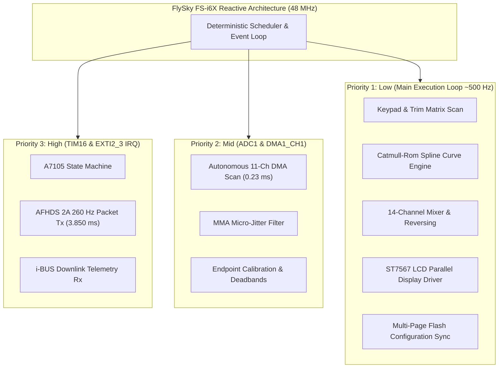

# flysky-i6x-rs

A minimalist, clean-slate RC transmitter firmware for the **FlySky FS-i6X**, written in `no_std` Rust.

Focused on the built-in **A7105** 2.4 GHz RF transceiver (**AFHDS2A** protocol), **i-BUS** telemetry, and the **128×64 LCD** interface.

---

## 1. Overview & Philosophy

The standard OpenTX/EdgeTX port for the FS-i6X ([OpenI6X](https://github.com/OpenI6X/opentx)) is an incredible engineering feat that fits a ~30,000 LOC C++ codebase into the microcontroller's 128 KB flash memory. However, it operates at ~94% flash capacity with less than 7 KB of headroom, making customization and maintenance difficult.

`flysky-i6x-rs` is a **clean-slate rewrite** in Rust designed with:
- **Zero-cost abstractions:** Microcontroller-native, static allocation, no heap allocations (`no_std`).
- **Hard Real-Time Concurrency:** Interrupt-driven scheduling using RTIC (or async Embassy) for deterministic sub-millisecond RF hopping and packet timing.
- **Strict Scope:** Dedicated support for the built-in hardware (A7105 AFHDS2A + i-BUS), 4-axis gimbals, switches, trims, and an OpenTX-inspired 128×64 monochrome UI.
- **Estimated Footprint:** ~35–50 KB Flash (leaving ~70 KB free) and ~3–4 KB RAM (leaving ~12 KB free).

---

## 2. Target Hardware Map (STM32F072VB)

| Peripheral | Controller / Spec | MCU Pins & Ports | Notes |
| :--- | :--- | :--- | :--- |
| **MCU** | STM32F072VB (Cortex-M0 @ 48 MHz) | ARMv6-M (`thumbv6m-none-eabi`) | 128 KB Flash, 16 KB SRAM |
| **RF Transceiver** | Amiccom **A7105** 2.4 GHz | **SPI1** + GPIOs | SPI1 (SCK, MOSI, MISO) |
| | Chip Select (CSN) | `PE12` (Active Low) | Fast GPIO output |
| | Antenna Switch | `PE10` (RF0), `PE11` (RF1) | Diversity / TR switch |
| | Packet Ready IRQ | `PB2` (EXTI2) | GIO2 line from A7105 (Tx/Rx done) |
| | RF Timer | `TIM16` | Periodic packet scheduling (~3.8ms–7.5ms) |
| **Display** | **ST7567** (128×64 Monochrome LCD) | 8-bit 6800 Parallel Bus | 1024-byte framebuffer in RAM |
| | Data Bus (D0..D7) | `PE0 .. PE7` | Full-byte ODR write (`GPIOE->ODR[7:0]`) |
| | Command/Data (RS) | `PB3` | Low = Command, High = Data |
| | Reset (RST) | `PB4` | Active Low hardware reset |
| | Read/Write (RW) | `PB5` | Kept Low for write mode |
| | Chip Select (CS) | `PD2` | Active Low (held Low for bus access) |
| | Strobe (RD / E) | `PD7` | 6800-series latch strobe (High -> Low pulse) |
| | Backlight (Stock) | `PF3` | **Active HIGH** (drives NPN transistor base) |
| | Backlight (Modded)| `PC9` | `TIM3_CH4` PWM dimming mod pad (Do NOT use `PB1`) |
| **Analog Inputs** | 12-bit ADC1 via DMA | 11 Channels scanned | Continuous circular DMA1 Ch1 buffer |
| | Sticks (RH, RV, LV, LH) | `PA0`, `PA1`, `PA2`, `PA3` | Channels 0 (Roll), 1 (Pitch), 2 (Thr), 3 (Yaw) |
| | Potentiometers (VRA, VRB)| `PA6`, `PA7` | Channels 6 (VR1 / Left), 7 (VR2 / Right) |
| | Switches (SA, SB, SC, SD)| `PA4`, `PA5`, `PB0`, `PB1` | Channels 4 (2-pos), 5 (3-pos), 8 (3-pos), 9 (2-pos) |
| | Battery Sense | `PC0` | Channel 10 (voltage divider: `(raw * 100) / 421 + 20`) |
| **Digital Keys** | 3 Columns × 4 Rows Matrix | Keypad & Trims | Polled at ~50–100 Hz |
| | Matrix Columns (R1..R3)| `PC6`, `PC7`, `PC8` | Driven Low sequentially |
| | Matrix Rows (L1..L4) | `PD12`, `PD13`, `PD14`, `PD15` | Inputs with internal pull-ups |
| | Inward Trim Keys | `PC6`+`PD13` & `PC7`+`PD14` | Roll Left (RHL) + Yaw Right (LHR) |
| | Dedicated Bind Key | `PF2` | Active Low (pull-up enabled) |
| **Storage** | On-chip Flash (Pages 62 & 63)| `0x0801_F000 .. 0x0801_FFFF` (4 KB) | 20 models + radio settings (2688 bytes) |
| **Telemetry / Serial**| UART Interfaces | `USART2` (PD5 Tx / PA15 Rx) | External telemetry / i-BUS mirror |
| **Audio** | Piezo Buzzer | `TIM1_CH1` (`PA8`) | Hardware PWM frequency & tone generator |

---

## 3. Software Architecture



### Key Libraries / Crates
- `cortex-m`, `cortex-m-rt`: Core ARM runtime and interrupt vector tables.
- `stm32f0xx-hal`: Embedded HAL implementation for STM32F0 peripherals.
- `embedded-graphics`: Monochrome UI primitive rendering, fonts, lines, and bitmaps.
- `embedded-hal`: Trait abstractions for SPI, I2C, and GPIO.

---

## 4. AFHDS2A & i-BUS Subsystem Design

### Frequency Hopping (FHSS)
AFHDS2A distributes transmission across 16 pseudo-random frequencies generated from the transmitter's unique silicon ID:
```
UID (at 0x1FFFF7AC) -> LCG Random Seed -> 16 Unique Channels (1..164 with min spacing >= 5)
```

### Packet Protocol
1. **Bind Packets (`0xBB` / `0xBC`):** Broadcasts TX ID and hopping table to allow receivers (e.g. FS-iA6B) to sync.
2. **Stick Data Packet (`0x58`):** 38-byte frame containing up to 14 channels encoded as microsecond pulses (1000–2000 µs).
3. **Settings Packet (`0xAA`):** Directs receiver output mode (PWM, PPM, i-BUS, or S.BUS).
4. **Telemetry Reception Window:** The transmitter switches the A7105 to RX immediately following packet transmission to receive i-BUS sensor telemetry frames (TX/RX voltage, RSSI, temperature, RPM, etc.).

---

## 5. Display & User Interface (128×64)

The ST7567 parallel LCD driver maintains a **1024-byte framebuffer** in SRAM (`128 * 64 / 8`). Updating the entire screen takes &lt; 1.2 ms via direct 8-bit GPIO port writes (`GPIOE->ODR`).

---

## 6. Project Documentation

Comprehensive technical documentation is maintained in the [`docs/`](docs/) directory:

- **[User Guide & Operations Manual](docs/USER_GUIDE.md)**: Complete operator guide covering flight dashboard, menu navigation, 20-model setup, throttle curves, calibration, and binding.
- **[System Architecture & Timing Model](docs/ARCHITECTURE.md)**: 48 MHz clock tree, real-time concurrency model, TIM16 260 Hz packet loop, Catmull-Rom curve math, and zero-heap memory layout.
- **[AFHDS 2A Protocol & A7105 RF Driver](docs/RF_PROTOCOL.md)**: SPI1 hardware driver, 16-channel FHSS hopping table, 38-byte packet structure, Model Match, and one-way/two-way receiver binding.
- **[Flight Inputs & Digital Trims](docs/INPUT_SUBSYSTEM.md)**: 11-channel continuous ADC DMA scanner, MMA jitter filtering, physical gimbal geometry, 4-axis digital trims, and TIM1 hardware PWM buzzer driver.
- **[Stick Calibration & Flash Persistence](docs/CALIBRATION_AND_STORAGE.md)**: 2-step interactive calibration wizard, tolerance margin calculation, and 20-model Flash storage architecture across Pages 62 & 63.
- **[Architecture & Performance Comparison](docs/FIRMWARE_COMPARISON.md)**: Deep-dive comparative analysis vs OpenI6X and stock firmware (Flash headroom, &lt;4ms latency, safety locks, backlight PWM mod).
- **[Hardware Reference & Pinout](docs/HARDWARE_REFERENCE.md)**: Detailed schematics, pin mappings, ST7567 LCD 6800-bus timings, buzzer PWM, and dual-MCU (STM32 / APM32) profiles.

---

## 7. Implementation Roadmap & Current Status

### Phase 1: Board Bring-Up & Display (COMPLETED)
- [x] Dual MCU support for both `STM32F072VB` and `APM32F072VB` (UID & DFU mapping).
- [x] Parallel 8-bit ST7567 driver for `GPIOE` (ODR write) + control lines with `embedded-graphics`.
- [x] Screen orientation correction, column 4 offset, and factory backlight driver (`PF3`).
- [x] Fast power-on boot (< 30 ms) and reliable DFU bootloader invocation.

### Phase 2: Analog & Digital Inputs (COMPLETED)
- [x] Continuous 11-channel DMA1 ADC1 scanner ($0.23\text{ ms}$ complete scan).
- [x] OpenTX Modified Moving Average (MMA) micro-jitter filter (0 latency on stick movement).
- [x] Decode 2-pos / 3-pos switches (`SA..SD`), rotary pots (`VRA`, `VRB`), and battery voltage (`PC0`).
- [x] Correct physical Mode 2 channel mapping (`PA0` Roll, `PA1` Pitch, `PA2` Throttle, `PA3` Yaw).

### Phase 3: A7105 SPI Driver & Protocol Timing (COMPLETED)
- [x] Amiccom A7105 hardware SPI1 driver with antenna diversity TR switching (`PE10`/`PE11`/`PE12`).
- [x] Deterministic 16-channel FHSS hopping table generated from 96-bit silicon UID.
- [x] External HSE crystal (48.000 MHz) and calibrated `TIM16` timer (`PSC = 47`, `ARR = 3849`) for exact 3850.0 µs (259.74 Hz) frame sync.

### Phase 4: AFHDS 2A Over-the-Air Link & Telemetry (COMPLETED)
- [x] 14-channel 38-byte stick frame generation ($1000 \dots 2000\,\mu\text{s}$).
- [x] 4-phase bidirectional bind sequence with persistent RX ID Flash storage.
- [x] Cancel / Abort binding mode via `[ESC]` (Cancel key) and support for one-way receivers (FS-A8S, Fli14).
- [x] Downlink telemetry reception window: live RSSI and RX battery voltage.

### Phase 5: Trims, Audio, & Calibration (COMPLETED)
- [x] Hardware PWM piezo buzzer driver on `PA8` (`TIM1_CH1`, 48 MHz / PSC 47) with distinct audio tones.
- [x] Digital trim controller with single-click, 90ms auto-repeat, audio feedback, and DFU lockout.
- [x] Throttle trim safety lock (Option 2) for flight controller arming protection.
- [x] Interactive 2-step gimbal & pot endpoint calibration wizard with Flash persistence.

### Phase 6: Settings Menu, Diagnostics, & Backlight Dimming (COMPLETED)
- [x] Hierarchical Settings Menu (`src/menu.rs`) navigated via `UP`, `DOWN`, `OK`, and `ESC`.
- [x] Radio Setup: Throttle Trim toggle (Option 2 safety lock), Beeper audio toggle, Backlight timeout (15s/30s/60s/Off), and Brightness level (10%..100%).
- [x] Hardware PWM backlight dimming driver on `PC9` (`TIM3_CH4`, 1 kHz PWM) supporting the popular backlight hardware mod while keeping stock `PF3` supported.
- [x] 14-channel live pulse width monitor with graphical bars and microsecond readouts (`1000..2000 µs`).
- [x] Real-time 12-bit Analog Diagnostics (`Diag Anas`) displaying raw counts ($0 \dots 4095$) for all 11 ADC channels.
- [x] System Information screen displaying MCU profile, 96-bit silicon UID, clock speed, and memory usage.

### Phase 7: 20-Model Memory & Smoothed Throttle Curves (COMPLETED)
- [x] 20 independent model memory slots (`M01`..`M20`), each allocated an exact 128-byte profile.
- [x] Multi-sector Flash driver across Pages 62 & 63 (`0x0801_F000`..`0x0801_FFFF`, 4 KB) with automatic legacy migration.
- [x] Model Match: independent `rx_id` per model profile with dynamic RF switching on model change.
- [x] Per-model digital trims (Roll, Pitch, Throttle, Yaw) and 14-channel reversing bitmask.
- [x] Switchable 5-point and 9-point throttle curves with optional **Catmull-Rom cubic Hermite spline** smoothing.
- [x] Real-time curve graph visualization ($44 \times 36$ pixels) in the on-screen throttle curve editor.
- [x] Model setup: 10-character ASCII model name editor and aircraft type selector.

### Current Firmware Footprint
- **Flash ROM**: **35.4 KB** used out of **128 KB** available (Flash Pages 0–17; Pages 18–61 free).
- **Static RAM**: **228 bytes** (`.data` + `.bss`) out of **16 KB** available (**>90% SRAM free**).
- **Non-Volatile Storage**: **2,688 bytes** allocated across Pages 62 & 63 (1,408 bytes free headroom).

---

## 8. Controls & Shortcuts

| Action | Control | Notes |
| :--- | :--- | :--- |
| **Open Settings Menu** | **Hold `OK` for 1.2s** | Opens Model Select, Model Setup, Ch Reverse, Thr Curve, Radio Setup, Calib, RX Setup, Monitors, & Diagnostics |
| **Direct Calibration (Boot)**| **Hold `OK` during Power-On** | Launches 2-step calibration wizard immediately on boot |
| **Initiate / Finish Binding**| **Tap `BIND` button** | Starts binding; finish & save for one-way receivers |
| **Abort / Cancel Binding** | **Press `Cancel` (`ESC`)** | Exits binding mode immediately and restores normal RF |
| **Enter DFU Bootloader** | **Inward Trims + Power ON** | Push Roll Left & Yaw Right inward while turning on |
| **Fast DFU Jump (Runtime)**| **Hold Inward Trims for 100 ms** | Re-enters ST factory ROM bootloader from main screen |
| **Digital Trims** | **4 Trim Rockers** | Single click + 90ms auto-repeat with audio pitch scaling |

---

## 9. Flashing & Reversion

- **Flash via USB DFU (`dfu-util`):**
  ```bash
  dfu-util -a0 -s 0x08000000:leave -d 0483:df11 -D target/flysky-i6x-rs.bin
  ```
- **Revert to OpenTX / OpenI6X:**
  Because the factory bootloader resides in permanent ROM, you can restore your original firmware anytime:
  ```bash
  dfu-util -a0 -s 0x08000000:leave -d 0483:df11 -D opentx_backup.bin
  ```

