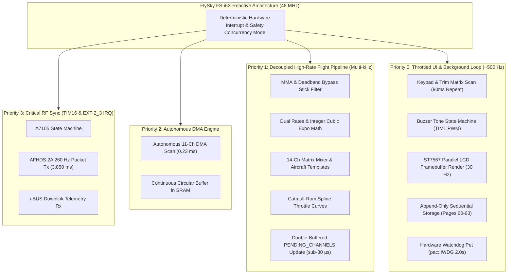

# flysky-i6x-rs

A minimalist, clean-slate RC transmitter firmware for the **FlySky FS-i6X**, written in `no_std` Rust.

Focused on the built-in **A7105** 2.4 GHz RF transceiver (**AFHDS2A** protocol), **i-BUS** telemetry, and the **128×64 LCD** interface.

---

## 1. Overview & Philosophy

The FS-i6X open-source journey was pioneered by the remarkable work of the [OpenI6X](https://github.com/OpenI6X/opentx) project, which successfully brought OpenTX/EdgeTX to this hardware and reverse-engineered the radio architecture.

`flysky-i6x-rs` explores a complementary design philosophy: an experimental, clean-slate firmware written in bare-metal `no_std` Rust designed with:
- **Zero-Heap, Deterministic Memory:** Fully static allocation with bare-metal `no_std`, eliminating dynamic allocation overhead, allocator stalls, and heap fragmentation.
- **Lock-Free Concurrency & Watchdog Recovery:** Deterministic priority-driven interrupt scheduling (`TIM16` 260 Hz packet sync, `EXTI2` RF ready) paired with lock-free atomic double-buffering. 2.0s independent hardware watchdog (`pac::IWDG`) with LSI clock isolation, debug halt freezing, bounded sync, and <2 ms in-flight warm reset recovery that bypasses startup interlocks to prevent lockouts.
- **Strict Scope:** Dedicated support for the built-in hardware (A7105 AFHDS2A + i-BUS), 4-axis gimbals, switches, trims, 20-model storage, 14-channel matrix mixer, and a 128×64 monochrome UI.
- **Lightweight Footprint:** **~110.5 KB Flash ROM** (leaving ~9.5 KB / ~7.9% headroom out of the 120 KB partition) and **~8.9 KB static RAM** + 1 KB LCD framebuffer + 1 KB USB PMA (leaving >7.0 KB stack safety margin). See [ARCHITECTURE.md](docs/ARCHITECTURE.md#4-memory-footprint) for the complete memory budget.

---

## 2. Target Hardware Map (STM32F072VB)

| Peripheral | Controller / Spec | MCU Pins & Ports | Notes |
| :--- | :--- | :--- | :--- |
| **MCU** | STM32F072VB (Cortex-M0 @ 48 MHz) | ARMv6-M (`thumbv6m-none-eabi`) | 128 KB Flash (120 KB code + 8 KB storage), 16 KB SRAM |
| **Watchdog** | Hardware Independent Watchdog | `pac::IWDG` (40 kHz LSI) | 2.0s hard timeout, `DBGMCU_APB1_FZ` halt freeze, sub-2ms in-flight warm recovery (`RCC_CSR`) |
| **RF Transceiver** | Amiccom **A7105** 2.4 GHz | **SPI1** + GPIOs | SPI1 (SCK, MOSI, MISO) |
| | Chip Select (CSN) | `PE12` (Active Low) | Fast GPIO output |
| | Antenna Switch | `PE10` (RF0), `PE11` (RF1) | Diversity / TR switch |
| | Packet Ready IRQ | `PB2` (EXTI2) | GIO2 line from A7105 (Tx/Rx done) |
| | RF Timer | `TIM16` | Periodic packet scheduling (~3.8ms–7.5ms) |
| **Display** | **ST7567** (128×64 Monochrome LCD) | 8-bit 6800 Parallel Bus | 1024-byte framebuffer in RAM; 30 Hz refresh (~33 ms); Electronic Volume (EV) contrast (15..55) |
| | Data Bus (D0..D7) | `PE0 .. PE7` | Full-byte ODR write (`GPIOE->ODR[7:0]`) |
| | Command/Data (RS) | `PB3` | Low = Command, High = Data |
| | Reset (RST) | `PB4` | Active Low hardware reset |
| | Read/Write (RW) | `PB5` | Kept Low for write mode |
| | Chip Select (CS) | `PD2` | Active Low (held Low for bus access) |
| | Strobe (RD / E) | `PD7` | 6800-series latch strobe (High -> Low pulse) |
| | Backlight (Stock) | `PF3` | **Active HIGH** (drives NPN transistor base) |
| | Backlight (Modded)| `PC9` | `TIM3_CH4` PWM dimming mod (pioneered by OpenI6X) |
| **Analog Inputs** | 12-bit ADC1 via DMA | 11 Channels (15 with P7) | Continuous circular DMA1 Ch1 buffer |
| | Sticks (RH, RV, LV, LH) | `PA0`, `PA1`, `PA2`, `PA3` | Channels 0 (Roll), 1 (Pitch), 2 (Thr), 3 (Yaw) |
| | Potentiometers (VRA, VRB)| `PA6`, `PA7` | Channels 6 (VR1 / Left), 7 (VR2 / Right) |
| | Switches (SA, SB, SC, SD)| `PA4`, `PA5`, `PB0`, `PB1` | Channels 4 (2-pos), 5 (3-pos), 8 (3-pos), 9 (2-pos) |
| | Battery Sense | `PC0` | Channel 10 (voltage divider: `(raw * 100) / 421 + 20`) |
| **Digital Keys** | 3 Columns × 4 Rows Matrix | Keypad & Trims | Polled at ~50–100 Hz |
| | Matrix Columns (R1..R3)| `PC6`, `PC7`, `PC8` | Driven Low sequentially |
| | Matrix Rows (L1..L4) | `PD12`, `PD13`, `PD14`, `PD15` | Inputs with internal pull-ups |
| | Inward Trim Keys | `PC6`+`PD13` & `PC7`+`PD14` | Roll Left (RHL) + Yaw Right (LHR) |
| | Dedicated Bind Key | `PF2` | Active Low (pull-up enabled) |
| **Storage** | On-chip Flash (Pages 60–63)| `0x0801_E000 .. 0x0801_FFFF` (8 KB) | Append-only sequential storage (Keys 0..20, ~2.8 ms save) |
| **Telemetry / Serial**| UART Interfaces | `USART2` (PD5 Tx / PA15 Rx) | External CRSF / ELRS module bay; interrupt RX with 128B ring buffer & ORE recovery |
| **USB Controller** | Native USB Full-Speed (12 Mbps)| `PA11` (D-) / `PA12` (D+) | Joystick HID, CDC-ACM Serial, Composite, Off |
| **Audio** | Piezo Buzzer | `TIM1_CH1` (`PA8`) | Hardware PWM frequency & tone generator |

---

## 3. Software Architecture


```mermaid
flowchart TD
    subgraph Core ["FlySky FS-i6X Reactive Architecture (48 MHz)"]
        SCHED["Deterministic Hardware Interrupt & Safety Concurrency Model"]
    end

    subgraph P3 ["Priority 3: Critical RF Sync (TIM16 & EXTI2_3 IRQ)"]
        RF1["A7105 State Machine"]
        RF2["AFHDS 2A 260 Hz Packet Tx (3.850 ms)"]
        RF3["i-BUS Downlink Telemetry Rx"]
    end

    subgraph P2 ["Priority 2: Autonomous DMA Engine"]
        ADC1["Autonomous 11-Ch DMA Scan (0.23 ms)"]
        ADC2["Continuous Circular Buffer in SRAM"]
    end

    subgraph P1 ["Priority 1: Decoupled High-Rate Flight Pipeline (Multi-kHz)"]
        FL1["MMA & Deadband Bypass Stick Filter"]
        FL2["Dual Rates & Integer Cubic Expo Math"]
        FL3["14-Ch Matrix Mixer & Aircraft Templates"]
        FL4["Catmull-Rom Spline Throttle Curves"]
        FL5["Double-Buffered PENDING_CHANNELS Update (sub-30 µs)"]
    end

    subgraph P0 ["Priority 0: Throttled UI & Background Loop (~500 Hz)"]
        UI1["Keypad & Trim Matrix Scan (90ms Repeat)"]
        UI2["Buzzer Tone State Machine (TIM1 PWM)"]
        UI3["ST7567 Parallel LCD Framebuffer Render (30 Hz)"]
        UI4["Append-Only Sequential Storage (Pages 60-63)"]
        UI5["Hardware Watchdog Pet (pac::IWDG 2.0s)"]
    end

    SCHED --> P3
    SCHED --> P2
    SCHED --> P1
    SCHED --> P0
```

### Key Libraries / Crates
- `cortex-m`, `cortex-m-rt`: Core ARM runtime and interrupt vector tables.
- `stm32f0`: Direct Peripheral Access Crate (PAC) for zero-overhead hardware control (`stm32f0::stm32f0x2::pac`).
- `sequential-storage`: Log-structured wear-levelled non-volatile storage engine with automatic compaction.
- `embedded-graphics`: Monochrome UI primitive rendering, fonts, lines, and bitmaps.
- `usb-device`, `usbd-hid`, `usbd-serial`: Embedded USB stack for Joystick and CDC-ACM serial composite device.

---

## 4. AFHDS2A & i-BUS Subsystem Design

### Frequency Hopping (FHSS)
AFHDS2A distributes transmission across 16 pseudo-random frequencies generated from the transmitter's unique silicon ID:
```
UID (at 0x1FFFF7AC) -> LCG Random Seed -> 16 Unique Channels (1..164 with min spacing >= 5)
```

### Packet Protocol
1. **Bind Packets (`0xBB` / `0xBC`):** Broadcasts TX ID and hopping table to allow receivers (e.g. FS-iA6B) to sync.
2. **Stick Data Packet (`0x58`):** 38-byte frame containing up to 14 channels encoded as microsecond pulses (1000–2000 µs).
3. **Settings Packet (`0xAA`):** Directs receiver output mode (PWM, PPM, i-BUS, or S.BUS).
4. **Telemetry Reception Window:** The transmitter switches the A7105 to RX immediately following packet transmission to receive i-BUS sensor telemetry frames (TX/RX voltage, RSSI, temperature, RPM, etc.).

---

## 5. Display & User Interface (128×64)

The ST7567 parallel LCD driver maintains a **1024-byte framebuffer** in SRAM (`128 * 64 / 8`). Updating the entire screen takes < 1.2 ms via direct 8-bit GPIO port writes (`GPIOE->ODR`).
- **Throttled Refresh Rate (30 Hz)**: Throttled via the hardware SysTick timer (`time::millis()`) to a steady 30 Hz (~33 ms). This completely decouples graphical drawing from the multi-kHz flight control loop, eliminating servo latency and stutter.
- **Electronic Volume (EV) Contrast Adjustment**: Digitally adjustable LCD contrast (`15..=55`, default 37 / `0x25`) in `Radio Setup` with instant live hardware preview and Flash persistence.
- **Ferrox-RC Startup Splash Screen**: 28x27 kinetic delta emblem, firmware name, and build version displayed for 1200 ms with concurrent, cadence-independent 4-note ascending welcome fanfare ($C_6 \to E_6 \to G_6 \to C_7$, 660 ms).
- **Multi-Page Flight Dashboard**: 5 switchable screens cycled by tapping `[BIND]` or pressing `[UP]` / `[DOWN]`:
  1. **Page 1/5 (Gimbals & Trims)**: Live stick sliders with Mode 2 right-aligned throttle, center markers, trim ticks, physical switch arrow glyphs (`^`/`-`/`v`), and dual split horizontal bar for VRa / VRb with center ticks.
  2. **Page 2/5 (Primary Channels 1..10)**: Real-time graphic bars and exact microsecond pulse readouts (988..2012 µs) across primary flight channels.
  3. **Page 3/5 (Auxiliary Channels 11..18)**: Real-time graphic bars and microsecond pulse readouts across auxiliary expansion channels.
  4. **Page 4/5 (Model Dashboard)**: Full 10-character model name with 12x12 model type glyph (Airplane, Glider, Heli, Quad, General/Boats), bound receiver ID, throttle curve configuration, and live flight timers.
  5. **Page 5/5 (Telemetry Sensors)**: Dedicated diagnostics showing real-time RSSI, link state, packet odometer counters (`TX`/`RX`), battery voltages (`RX`/`TX`), and session extremes (`mRSS`/`mRX`).
- **Dynamic Horizontal Battery Gauge**: High-contrast battery icon in the status bar with live 3-stage charge bars (empties left-to-right from tip as voltage drops, and fills right-to-left from base).
- **3-Slot Icon Menu & Proportional Scrollbar**: 12x12 MDI glyphs, high-contrast selection highlights, proportional right-edge scrollbar, and return position preservation across all submenus.

---

## 6. Project Documentation

Comprehensive technical documentation is maintained in the [`docs/`](docs/) directory:

- **[User Guide & Operations Manual](docs/USER_GUIDE.md)**: Complete operator guide covering flight dashboard, menu navigation, 20-model setup, throttle curves, calibration, and binding.
- **[System Architecture & Timing Model](docs/ARCHITECTURE.md)**: 48 MHz clock tree, real-time concurrency model, TIM16 260 Hz packet loop, Catmull-Rom curve math, and zero-heap memory layout.
- **[AFHDS 2A Protocol & A7105 RF Driver](docs/RF_PROTOCOL.md)**: SPI1 hardware driver, 16-channel FHSS hopping table, 38-byte packet structure, Model Match, and one-way/two-way receiver binding.
- **[Flight Inputs & Digital Trims](docs/INPUT_SUBSYSTEM.md)**: 11/15-channel continuous ADC DMA scanner, MMA jitter filtering, physical gimbal geometry, 4-axis digital trims, and TIM1 hardware PWM buzzer driver.
- **[Flight Control & 18-Channel Mixing](docs/MIXER.md)**: 4-stage pipeline, integer cubic expo, Delta/V-Tail/Flaperon templates, auxiliary channel remapping, and EdgeTX freeform matrix mixing.
- **[Stick Calibration & Flash Persistence](docs/CALIBRATION_AND_STORAGE.md)**: 2-step interactive calibration wizard, tolerance margin calculation, and 4-page append-only sequential storage engine across Pages 60–63.
- **[USB Subsystem & Simulator Manual](docs/USB_SUBSYSTEM.md)**: Hardware Full-Speed USB driver, 100 Hz HID Gamepad descriptor (8 axes, 16 buttons), CDC-ACM telemetry/CLI, and silent RF standby.
- **[CRSF / ExpressLRS Subsystem Guide](docs/CRSF_ELRS_GUIDE.md)**: Native CRSF/ELRS driver, USART2 setup (`PD5`/`PA15`), `PC13` module power control, on-radio parameter configurator, and live link diagnostics.
- **[CRSF Protocol Specification & Verification](docs/CRSF_PROTOCOL_SPEC.md)**: Byte-level wire format, CRC8-DVB calculation, parameter discovery handshake, state machine lifecycle, and manual verification guide.
- **[Testing Methodology & Verification Guide](docs/TESTING.md)**: Dual-target host test harness, non-invasive peripheral decoupling, deterministic mock timing, adversarial state machine verification, and test execution guide.
- **[Ecosystem Context & Background](docs/FIRMWARE_COMPARISON.md)**: Background on open-source FS-i6X firmware development, OpenI6X foundations, and the Rust architectural philosophy.
- **[Implementation Roadmap & Phase Status](docs/ROADMAP.md)**: Phased implementation breakdown from board bring-up through hardware mods (SE/SF switches, P7 ADC inputs), planned phases (Trainer PPM/SBUS), and flash/RAM footprints.
- **[Hardware Reference & Pinout](docs/HARDWARE_REFERENCE.md)**: Detailed schematics, pin mappings, ST7567 LCD 6800-bus timings, buzzer PWM, and dual-MCU (STM32 / APM32) profiles.

---

## 7. Controls & Shortcuts

| Action | Control | Notes |
| :--- | :--- | :--- |
| **Cycle Flight Pages** | **`[UP]` / `[DOWN]` or Tap `[BIND]`** | Steps through Page 1/5 (Gimbals & Timer), Page 2/5 (CH 1..10 Monitor), Page 3/5 (CH 11..18 Monitor), Page 4/5 (Model Dashboard), and Page 5/5 (Telemetry Sensors) |
| **Reset Flight Timer** | **Hold `[CANCEL]` (>= 1.0s)** | Displays centered HUD progress bar on flight screen; resets timer with chime on 1.0s completion |
| **Open Settings Menu** | **Hold `OK` for 1.2s** | Opens 13 submenus: Model Select, Model Setup, D/R & Expo, Thr Curve, Wing/Mixer, Aux Channels, Ch Reverse, Radio Setup, Protocol Setup, Monitors, Calib, Diag, & Info |
| **Rapid Menu / Value Scroll** | **Hold `UP` or `DOWN`** | Auto-repeats every 70 ms after 300 ms hold across all menus, character editing, and curve points |
| **Direct Calibration (Boot)**| **Hold `OK` during Power-On** | Launches 2-step calibration wizard immediately on boot |
| **Initiate Receiver Binding**| **Hold `BIND` (>= 1.0s)** | Starts AFHDS 2A binding from any flight page (or hold during power-on) |
| **Abort / Cancel Binding** | **Press `Cancel` (`ESC`)** | Exits binding mode immediately and restores normal RF |
| **Tab / Advance Cursor** | **`OK` or `BIND` in Editors** | Advances character cursor in naming editor, point selection in curve editor, and field toggle in Protocol Setup |
| **Enter DFU Bootloader (Boot)** | **Inward Trims + Power ON** | Push Roll Left & Yaw Right inward while switching on (Primary hardware recovery/flashing mode) |
| **Digital Trims** | **4 Trim Rockers** | Single click + 90ms auto-repeat with audio pitch scaling |

---

## 8. Flashing, Full Flash Backup, & Reversion

The stock FlySky FS-i6X features a built-in Micro-USB port wired directly to the microcontroller. Flashing or backing up requires no ST-Link probe or permanent hardware modifications:

### Step 1: Enter Factory ROM DFU Mode

The method to enter DFU bootloader mode depends on whether you are currently on stock FlySky factory firmware or already running custom firmware:

#### A. First-Time Flashing from Stock Factory Firmware (R53 Bootloader Access)
Because the original stock FlySky factory firmware does not include a software key check to trigger the DFU bootloader, entering DFU mode for the first time requires hardware access to the `BOOT0` line via the **`R53`** solder pads:
1. Ensure the transmitter is switched **OFF** and remove the rear case screws.
2. Carefully separate the rear case. Be aware of the battery wires connected between the two halves. Once separated, locate the two unpopulated solder pads labeled **`R53`** on the back of the motherboard (near the microcontroller). It is best to connect the USB cable to the rear case now.
3. Momentarily bridge/short the two `R53` pads using tweezers, a jumper wire, or a screwdriver tip.
4. While holding the bridge across `R53`, have the USB cable connected to your PC and switch the transmitter power switch **ON**.
5. Bridging `R53` pulls the MCU's `BOOT0` pin to 3.3V, causing the chip to boot directly into its factory ROM DFU bootloader (`0483:df11` for STM32, `314b:0106` for APM32). The transmitter screen remains blank, and the PC detects the device as `STM32 BOOTLOADER`.
6. Once powered on, you can remove the bridge across `R53`. You do not need to keep it bridged while flashing.

> [!TIP]
> For board photos, pad locations, and Windows driver setup (Zadig / STM32CubeProgrammer), refer to the comprehensive [OpenI6X Flashing & Upgrading Guide](https://github.com/OpenI6X/opentx/wiki/Flashing-&-Upgrading).

#### B. Upgrading from Custom Firmware (OpenI6X or flysky-i6x-rs)
Once custom firmware is installed, **no disassembly or opening the case is ever needed again**:
1. Ensure the transmitter is switched **OFF**.
2. Push both horizontal trim buttons inward towards the power switch (**Roll Left** + **Yaw Right**) and switch the radio **ON**.
3. The firmware immediately triggers the software DFU bootloader jump and enumerates over USB.

### Step 2: Backup Entire Flash Memory (CRITICAL BEFORE FIRST FLASH)
Before flashing any custom firmware, pilots should pull their complete 128 KB on-chip Flash memory (including stock firmware, factory calibration, and existing model data) directly to a file for 100% safe, instant reversion:
```bash
# Pull complete 128 KB on-chip Flash to a local backup file:
dfu-util -a 0 -s 0x08000000:131072 -U stock_backup.bin
```

### Step 3: Flash flysky-i6x-rs
Flash the compiled release binary via USB DFU:
```bash
# For STM32F072:
dfu-util -a 0 -s 0x08000000:leave -D flysky-i6x.bin

# For APM32F072:
dfu-util -a 0 -d 314b:0106 -s 0x08000000:leave -D flysky-i6x.bin
```

> [!TIP]
> **DFU Error State (`DFU state(10) = dfuERROR`)?**
> If `dfu-util` reports `Device's firmware is corrupt. It cannot return to run-time operations`, this is **not** a firmware bug or hardware fault. It is generated by the chip's factory ROM bootloader when a prior transfer ended without `:leave` or was interrupted.
> - **Clear the error**: Run `dfu-util -a 0 -e` to send a `DFU_CLRSTATUS` reset.
> - **Prevention**: Always include `:leave` on `-s 0x08000000:leave` so the bootloader exits cleanly.
> - **Consequence of ignoring**: Subsequent flash or read attempts will halt until the status is cleared.

### Step 4: Revert to OpenTX / Stock Anytime
Because the hardware DFU bootloader is stored in permanent, read-only system ROM by STMicroelectronics, the transmitter is **unbrickable**. You can restore your full flash backup at any time:
```bash
dfu-util -a 0 -s 0x08000000:leave -D stock_backup.bin
```

---

## 9. Development Methodology, Automated Testing, & AI Assistance

This project was built through a **human-directed, AI-assisted development workflow** ("vibe-coding" with rigorous physical hardware bench testing and automated test harnesses). Having previously contributed to OpenI6X, domain knowledge of the FS-i6X hardware, pinouts, and protocol timings was used to direct LLM pair-programming tools to rapidly implement the `no_std` Rust architecture.

### Automated Testing & Dual-Target Harness
To guarantee mathematical correctness and protocol compliance without requiring a physical radio or slow hardware emulators, `flysky-i6x-rs` features a **zero-file-move dual-target test harness**:
- **Host Unit Test Execution**: Running `cargo test-host` compiles the codebase against the host target (`x86_64`) with standard library support, executing 36 unit and adversarial regression tests across flight curves, digital trims, matrix mixers, and CRSF/ELRS state machines in **sub-millisecond time**.
- **Peripheral & Timing Decoupling**: Peripheral drivers (`uart.rs`, `time.rs`) use `#[cfg(test)]` mocks to simulate serial UART FIFO queues and advance virtual time deterministically.
- **Physical Hardware Validation**: Every subsystem (DMA ADC scanning, A7105 SPI/RF state machine, ST7567 parallel bus LCD, USB HID/CDC descriptors, USART2 CRSF/ELRS engine, and Flash storage) has been deployed and verified on real FlySky FS-i6X hardware.

For detailed test architecture, adversarial verification scenarios, and developer commands, refer to the **[Testing Methodology & Verification Guide](docs/TESTING.md)**.

We welcome community code review, contributions, and PRs to continue refining and hardening the codebase!

---

## 10. Acknowledgments & Prior Art

This project stands on the shoulders of the open-source RC community and owes special gratitude to:

- **Kuba (qba667), Janek (ajjjjjjjj), and the OpenI6X Team**: For their groundbreaking reverse-engineering of the FlySky FS-i6X hardware, bus timings, ST7567 LCD initialization sequence, A7105 SPI registers, bootloader jump sequences, and the `PC9` backlight PWM dimming mod. Without their pioneering work and generous sharing of hardware research, this project would not have been possible.
- **Wimalopaan**: For extensive real-hardware testing, logic analyzer protocol traces, invaluable architectural feedback on TBS-Agent UI paradigms, over-the-air CRSF framing diagnostics, and deep verification of ExpressLRS parameter synchronization on the FS-i6X platform.
- **OpenTX and EdgeTX Teams**: For defining modern open-source RC transmitter mixing, telemetry architectures, and simulator standards.
- **ExpressLRS & Team BlackSheep**: For pioneering open, high-performance CRSF protocols and parameter synchronization.

---

## 11. License & Disclaimer of Liability

This project is open-source software provided under the **GNU General Public License v3.0 (GPL-3.0)**.

### Disclaimer of Warranty
THE SOFTWARE IS PROVIDED "AS IS", WITHOUT WARRANTY OF ANY KIND, EXPRESS OR IMPLIED, INCLUDING BUT NOT LIMITED TO THE WARRANTIES OF MERCHANTABILITY, FITNESS FOR A PARTICULAR PURPOSE, TITLE, AND NONINFRINGEMENT. IN NO EVENT SHALL THE AUTHORS, MAINTAINERS, OR COPYRIGHT HOLDERS BE LIABLE FOR ANY CLAIM, DAMAGES, OR OTHER LIABILITY, WHETHER IN AN ACTION OF CONTRACT, TORT, OR OTHERWISE, ARISING FROM, OUT OF, OR IN CONNECTION WITH THE SOFTWARE OR THE USE OR OTHER DEALINGS IN THE SOFTWARE.

### Operational Safety Warning
Operating radio-controlled aircraft, multirotors, and vehicles involves inherent risks of personal injury, property damage, and loss of life. Flashing custom or experimental firmware is done entirely at your own risk. 

Pilots are solely responsible for:
1. Conducting comprehensive ground bench tests and fail-safe verification (e.g., motor shutoff on radio power loss) prior to flight.
2. Performing physical range checks in accordance with local model aviation safety guidelines.
3. Complying with all local radio frequency regulations, transmission power limits, and model aviation safety codes.

