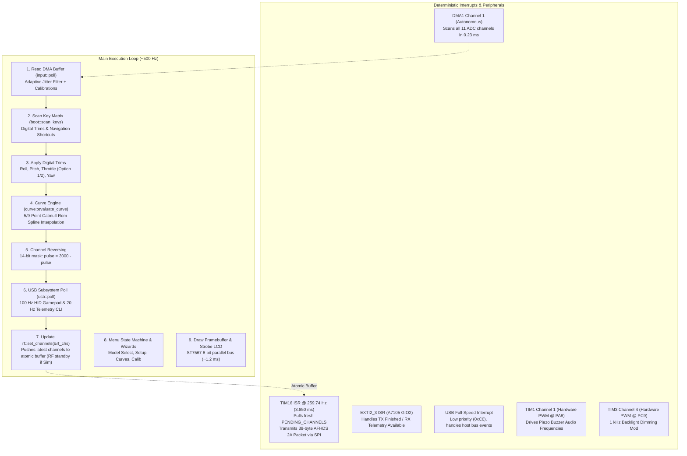

# SOFTWARE ARCHITECTURE & TIMING MODEL

`flysky-i6x-rs` uses a bare-metal, `no_std` reactive architecture designed for deterministic RF packet timing and sub-millisecond control latency on the STM32F072VB Cortex-M0 microcontroller.

---

## 1. Clock Tree Configuration

| Component | Setting | Notes |
| :--- | :--- | :--- |
| **Primary Oscillator** | **HSE Crystal @ 8.000 MHz** | Clean external quartz crystal on pins `PD0`/`PD1` |
| **PLL Multiplier** | **PLLMUL = 6** | 8.000 MHz * 6 = **48.000 MHz** core clock |
| **Flash Latency** | **1 Wait State (`LATENCY = 1`)** | Mandatory for Cortex-M0 operation above 24 MHz |
| **System Busses** | **AHB = 48 MHz, APB = 48 MHz** | Prescalers set to 1 for maximum peripheral throughput |
| **USB Physical Clock** | **USBSW = 1 (PLLCLK)** | Routes 48.000 MHz PLL directly to USB peripheral (`RCC_CFGR3` bit 7) |

Implemented in [`src/chip/mod.rs`](../src/chip/mod.rs).

---

## 2. Real-Time Concurrency Model



### Interrupt Priorities
- **High Priority (RF Transmission)**: `TIM16` fires strictly every **3.850 ms** (259.74 Hz). It pulls the latest pre-computed channel microsecond pulses from `PENDING_CHANNELS` and initiates A7105 SPI transmission. Priority = `0x80`.
- **Medium Priority (Radio Event)**: `EXTI2_3` fires on A7105 GIO2 line transitions (packet transmission complete or downlink telemetry packet received). Priority = `0x80`.
- **Autonomous DMA**: `DMA1_CH1` transfers all 11 ADC channels directly into circular SRAM buffers with zero CPU intervention.
- **Hardware Timers**: `TIM1` generates non-blocking audio frequencies on `PA8`; `TIM3` generates 1 kHz PWM brightness control on `PC9`.
- **Low Priority (USB Physical Layer)**: The USB interrupt is assigned priority `0xC0`. Because RF interrupts have higher priority (`0x80`), USB transactions or host bus stalls can never preempt or delay an over-the-air packet.
- **Background / Main Loop**: Decoupled control loop architecture; the real-time flight control pipeline (ADC sampling, lightweight 4-sample filtering with dynamic deadband bypass, matrix mixer, D/R & expo, throttle curves) executes in under 30 µs at multi-kHz pass rates, updating double-buffered `PENDING_CHANNELS` for RF transmission, while ST7567 LCD frame rendering and SPI flushing are throttled to a smooth 30 Hz (~33 ms).

---

## 3. Channel Latency & Data Freshness

1. **Continuous ADC Scan**: All 11 channels (4 sticks, 4 switches, 2 pots, battery) are digitized continuously by ADC1 via DMA in **0.23 ms** (252 cycles * 11 / 12 MHz).
2. **Double-Buffered Channels**: The flight loop updates `PENDING_CHANNELS` within critical sections (`cortex_m::interrupt::free`).
3. **Guaranteed Fresh Packets**: Because the decoupled flight control loop runs at kHz rates while the RF transmitter transmits at ~260 Hz, **every over-the-air packet carries fresh, up-to-date stick data** with end-to-end latency under **2.0 ms**.

---

## 4. Memory Footprint
 
Measured on release builds (`thumbv6m-none-eabi`, opt-level = "z", LTO = "fat"):
- **Firmware Binary**: **74.9 KB** (84,064 bytes binary) out of **128 KB** available.
- **Free Program Space**: **~53 KB** (~41.5% Flash free headroom) remaining for future expansions.
- **Non-Volatile Storage (Flash Pages 62–63)**: **2,688 bytes** allocated for global radio configuration and 20 full model profiles (1,408 bytes free headroom).
- **SRAM (16 KB total)**: **2.8 KB** static allocation (`.data` 1,776 bytes + `.bss` 1,120 bytes) + 1024-byte LCD framebuffer + 1024-byte USB Packet Memory Area (PMA). **Over 82% of SRAM remains free**, with **> 6.3 KB** guaranteed stack margin preventing any stack-on-static collision.
- **Zero Heap & In-Place Loading**: Entirely static allocation; no dynamic heap allocations, no `alloc` crate, and zero pass-by-value stack instantiation for 2.7 KB model storage structures.

---

## 5. Throttle Curve Engine & Catmull-Rom Spline Math (`src/curve.rs`)

The curve engine transforms normalized stick inputs (0..1000) into tailored output curves:
- **Modes**: 5-point (0%, 25%, 50%, 75%, 100%) and 9-point (0%, 12.5%, 25%, ..., 100%).
- **Linear Interpolation**:
  ```text
  val = y0 + ((y1 - y0) * delta_x) / x_span
  ```
- **Catmull-Rom Cubic Spline Smoothing**:
  To achieve smooth, C1-continuous throttle response without flat inflection points or aggressive step changes, the engine evaluates standard Catmull-Rom cubic Hermite splines:
  ```text
  P(t) = 0.5 * (2*P1 + (-P0 + P2)*t + (2*P0 - 5*P1 + 4*P2 - P3)*t^2 + (-P0 + 3*P1 - 3*P2 + P3)*t^3)
  ```
- **Deterministic Fixed-Point Execution**:
  Implemented using integer-only fixed-point arithmetic (`t` scaled by 1024). Spline interpolation executes in **< 60 CPU clock cycles** (< 1.25 µs at 48 MHz), meaning spline smoothing imposes zero perceptible latency on the control loop.
