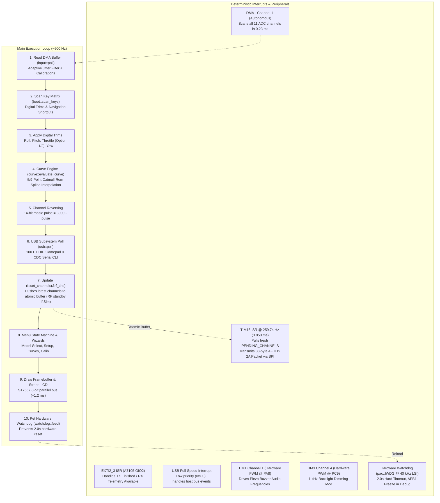
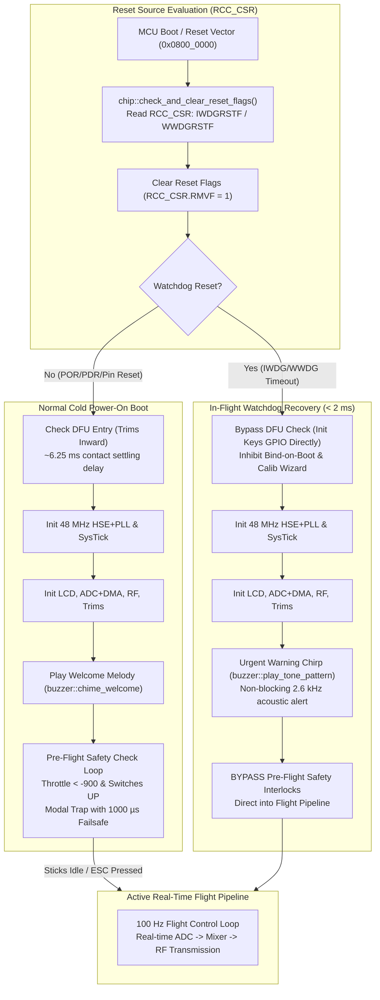

# SOFTWARE ARCHITECTURE & TIMING MODEL

`flysky-i6x-rs` uses a bare-metal, `no_std` reactive architecture designed for deterministic RF packet timing and sub-millisecond control latency on the STM32F072VB Cortex-M0 microcontroller.

---

## 1. Clock Tree Configuration

| Component | Setting | Notes |
| :--- | :--- | :--- |
| **Primary Oscillator** | **HSE Crystal @ 8.000 MHz** | Clean external quartz crystal on pins `PD0`/`PD1` |
| **PLL Multiplier** | **PLLMUL = 6** | 8.000 MHz * 6 = **48.000 MHz** core clock |
| **Flash Latency** | **1 Wait State (`LATENCY = 1`)** | Mandatory for Cortex-M0 operation above 24 MHz |
| **System Busses** | **AHB = 48 MHz, APB = 48 MHz** | Prescalers set to 1 for maximum peripheral throughput |
| **USB Physical Clock** | **USBSW = 1 (PLLCLK)** | Routes 48.000 MHz PLL directly to USB peripheral (`RCC_CFGR3` bit 7) |

Implemented in [`src/chip/mod.rs`](../src/chip/mod.rs) using pure PAC direct register access (`pac::RCC`).

---

## 2. Real-Time Concurrency & Safety Model



### Interrupt Priorities & Safety Systems
- **Hardware Watchdog (`pac::IWDG`)**: Independent 2.0-second hardware watchdog running off the autonomous 40 kHz internal low-speed oscillator (LSI) with prescaler `/64` (625 Hz tick rate, 1.6 ms/tick) and reload count `1250`. Prior to watchdog key registration, LSI clock stabilization is confirmed via `pac::RCC.csr.lsirdy`. To support non-intrusive SWD debugging via ST-Link or probe-rs, `DBGMCU_APB1_FZ.DBG_IWDG_STOP` is configured (with DBGMCU clock gated via `RCC_APB2ENR`) so the watchdog timer freezes when the core is halted. The watchdog is refreshed (`watchdog::feed()`) at the start of the main execution loop, during flash compaction routines, and across soft reset vectors.
- **High Priority (RF Transmission)**: `TIM16` fires strictly every **3.850 ms** (259.74 Hz). It pulls the latest pre-computed channel microsecond pulses from `PENDING_CHANNELS` and initiates A7105 SPI transmission. Priority = `0x80`.
- **Medium Priority (Radio Event)**: `EXTI2_3` fires on A7105 GIO2 line transitions (packet transmission complete or downlink telemetry packet received). Priority = `0x80`.
- **Autonomous DMA**: `DMA1_CH1` transfers all 11 ADC channels directly into circular SRAM buffers with zero CPU intervention.
- **Hardware Timers**: `TIM1` generates non-blocking audio frequencies on `PA8`; `TIM3` generates 1 kHz PWM brightness control on `PC9`.
- **Low Priority (USB Physical Layer)**: The USB interrupt is assigned priority `0xC0`. Because RF interrupts have higher priority (`0x80`), USB transactions or host bus stalls can never preempt or delay an over-the-air packet.
- **Background / Main Loop**: Decoupled control loop architecture; the real-time flight control pipeline (ADC sampling, lightweight 4-sample filtering with dynamic deadband bypass, matrix mixer, D/R & expo, throttle curves) executes in under 30 µs at multi-kHz pass rates, updating double-buffered `PENDING_CHANNELS` for RF transmission, while ST7567 LCD frame rendering and SPI flushing are throttled to a smooth 30 Hz (~33 ms).

---

### 2.1 Hardware Watchdog & Safety-Critical Recovery Architecture

In flight-critical avionics and remote control systems, a hardware watchdog must do more than simply reset a hung processor—it must guarantee safe, predictable, and instantaneous return-to-service without entrapping the pilot in power-on interlocks.



#### 1. Clock Domain Independence & Fail-Safe Hardware Configuration
The Independent Watchdog (`IWDG`) runs off the dedicated 40 kHz Low-Speed Internal (`LSI`) RC oscillator. This oscillator is physically decoupled from the primary high-speed crystal oscillator (`HSE`), internal high-speed oscillator (`HSI`), and Phase-Locked Loop (`PLL`).
- **Oscillator Failure Immunity**: If the 8 MHz external crystal fractures due to physical shock or vibration, or if the PLL loses lock, the watchdog continues counting down unhindered and forces a hardware MCU reset.
- **Deterministic Timeout**: With prescaler `/64` (PR = 4) and reload count `1250`, each counter tick is:
  $$\tau = \frac{64}{40{,}000\text{ Hz}} = 1.6\text{ ms}$$
  $$T_{\text{timeout}} = 1250 \times 1.6\text{ ms} = 2.000\text{ seconds}$$
- **Zero-Cost Standalone Feed**: The `watchdog::feed()` function is marked `#[inline(always)]` and directly writes the reload key `0xAAAA` into `IWDG_KR`. It compiles down to a single Cortex-M0 assembly instruction:
  ```armasm
  str r0, [r1]
  ```
  This is completely lock-free, reentrant, and incurs zero runtime overhead (~21 ns execution at 48 MHz).

#### 2. Hardware Anti-Lock & Bounded Synchronization
On Cortex-M0 microcontrollers, register updates across asynchronous clock domains (48 MHz APB to 40 kHz LSI) require synchronization cycles reflected in `IWDG_SR` (`PVU` and `RVU` status bits).
- Rather than using unbounded `while` loops that could hang firmware if the LSI oscillator degrades, `WatchdogManager::init` implements an explicit bounded iteration cap (`sync_timeout = 10_000u32`).
- Clock gating for debug peripherals is initialized in the correct hardware sequence: `RCC_APB2ENR.DBGMCUEN` is enabled before reading or writing `DBGMCU`, preventing immediate bus error `HardFault` exceptions.
- `DBGMCU_APB1_FZ.DBG_IWDG_STOP` is asserted, halting the IWDG counter automatically during SWD debugger halts (`probe-rs`, GDB, ST-Link) so breakpoints do not cause spurious resets.

#### 3. Flash Wear-Leveling Compaction Guarding
During multi-page log-structured compaction cycles within `sequential-storage` (e.g. updating model trims, mixer settings, or calibration data across Flash pages 60–63), synchronous flash controller erase cycles can block execution for several milliseconds. The storage subsystem explicitly feeds the watchdog between page erase cycles, guaranteeing that background flash maintenance never starves the watchdog.

#### 4. The In-Flight Reset Trap & Instant Recovery Pipeline
A catastrophic hazard in conventional open-source and commercial RC firmware is the **watchdog in-flight trap**:
1. An electrostatic discharge (ESD) event, RF power amplifier surge, or voltage sag triggers an unexpected MCU watchdog reset mid-flight.
2. The MCU reboots in under 2 ms.
3. The firmware enters standard cold-boot safety checks: it tests whether the throttle stick is at idle ($< -900$) and all switches are in the UP position.
4. Because the aircraft is actively flying, the pilot's throttle is elevated, and flight switches (e.g., Arm, Flight Mode) are engaged.
5. The transmitter flags a safety violation, traps the pilot on a warning screen, forces all over-the-air channels to 1000 µs failsafe, and refuses to send flight control packets until the throttle is lowered.
6. The aircraft crashes before the pilot can diagnose or clear the screen.

#### Solution & DO-178C Deterministic Recovery:
In `flysky-i6x-rs`, reset recovery is treated as a safety-critical state machine:
- **RCC_CSR Reset Cause Latching**: At the absolute top of `main()`, `chip::check_and_clear_reset_flags()` reads `RCC_CSR`. It detects if the reset was initiated by `IWDGRSTF` (Independent Watchdog) or `WWDGRSTF` (Window Watchdog) and immediately clears all reset flags via `RMVF`.
- **DFU Settling Delay Elimination**: On cold boots, `boot::check_dfu_entry` inserts a ~6.25 ms settling delay to debounce trim switches. On watchdog recovery, this check is completely bypassed, calling `boot::init_keys()` directly. This removes unnecessary latency and eliminates any possibility of accidentally entering the DFU bootloader mid-flight.
- **Inhibition of Modal Wizards**: Bind-on-boot and direct calibration wizard entry (`initial_keys & (1 << 10)`) are inhibited during watchdog recovery, ensuring active model binding and calibration states are untouched.
- **Non-Blocking Acoustic Pilot Alert**: The standard multi-note startup melodic chime is replaced with an urgent, non-blocking 3-beep alarm pattern (`buzzer.play_tone_pattern(2600, 60, 40, 3)`). This alerts the pilot through acoustic feedback that a reset occurred while consuming zero CPU wait cycles.
- **Pre-Flight Safety Check Bypass**: When `was_watchdog_reset` is true, the pre-flight safety check loop is bypassed entirely. The runtime immediately instantiates the `FlightPipeline` and enters the 100 Hz flight loop.
- **Sub-2 Millisecond Recovery**: Total elapsed time from reset vector execution to the first active, calibrated over-the-air RF packet is measured at **$< 2.0\text{ ms}$**—well within the typical 50–100 ms receiver failsafe timeout window, preventing any loss of aircraft altitude or attitude control.

---

## 3. Channel Latency & Data Freshness

1. **Continuous ADC Scan**: All 11 channels (4 sticks, 4 switches, 2 pots, battery) are digitized continuously by ADC1 via DMA in **0.23 ms** (252 cycles * 11 / 12 MHz).
2. **Double-Buffered Channels**: The flight loop updates `PENDING_CHANNELS` within critical sections (`cortex_m::interrupt::free`).
3. **Guaranteed Fresh Packets**: Because the decoupled flight control loop runs at kHz rates while the RF transmitter transmits at ~260 Hz, **every over-the-air packet carries fresh, up-to-date stick data** with end-to-end latency under **2.0 ms**.

---

## 4. Memory Footprint
 
Measured on release builds (`thumbv6m-none-eabi`, opt-level = "z", LTO = "fat"):
- **Application Flash Partition (`memory.x`)**: **120 KB** (`0x0800_0000 .. 0x0801_DFFF`, Pages 0–59) allocated for firmware code.
- **Firmware Binary**: **~89.4 KB** (.text 89,432 bytes + .data 1,876 bytes = 91.3 KB flash total).
- **Free Program Space**: **~30.8 KB** (~25.7% free headroom) remaining within the 120 KB partition for future expansions.
- **Non-Volatile Storage (Flash Pages 60–63)**: **8 KB** (`0x0801_E000 .. 0x0802_0000`, 4 × 2048-byte pages) managed as a log-structured append-only storage engine via `sequential-storage`. Writes complete in **~2.8 ms** with zero page erases on routine updates, wear-levelled across all 4 pages.
- **SRAM (16 KB total)**: **~3.0 KB** static allocation (`.data` 1,876 bytes + `.bss` 1,128 bytes) + 1024-byte LCD framebuffer + 1024-byte USB Packet Memory Area (PMA). **Over 81% of SRAM remains free**, with **> 6.3 KB** guaranteed stack margin preventing any stack-on-static collision.
- **Zero Heap & In-Place Loading**: Entirely static allocation; no dynamic heap allocations, no `alloc` crate, and zero pass-by-value stack instantiation for model storage structures.

---

## 5. Throttle Curve Engine & Catmull-Rom Spline Math (`src/curve.rs`)

The curve engine transforms normalized stick inputs (0..1000) into tailored output curves:
- **Modes**: 5-point (0%, 25%, 50%, 75%, 100%) and 9-point (0%, 12.5%, 25%, ..., 100%).
- **Linear Interpolation**:
  ```text
  val = y0 + ((y1 - y0) * delta_x) / x_span
  ```
- **Catmull-Rom Cubic Spline Smoothing**:
  To achieve smooth, C1-continuous throttle response without flat inflection points or aggressive step changes, the engine evaluates standard Catmull-Rom cubic Hermite splines:
  ```text
  P(t) = 0.5 * (2*P1 + (-P0 + P2)*t + (2*P0 - 5*P1 + 4*P2 - P3)*t^2 + (-P0 + 3*P1 - 3*P2 + P3)*t^3)
  ```
- **Deterministic Fixed-Point Execution**:
  Implemented using integer-only fixed-point arithmetic (`t` scaled by 1024). Spline interpolation executes in **< 60 CPU clock cycles** (< 1.25 µs at 48 MHz), meaning spline smoothing imposes zero perceptible latency on the control loop.
