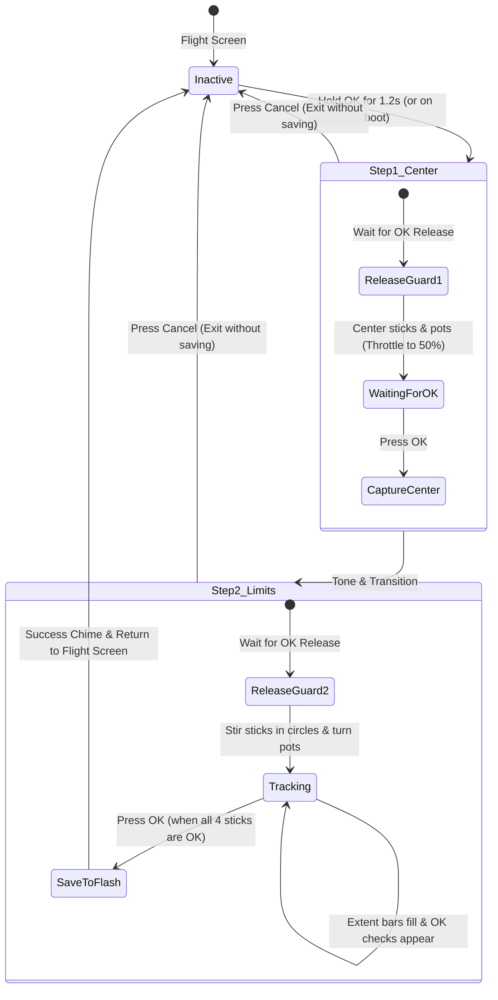

# STICK CALIBRATION & FLASH PERSISTENCE

Technical documentation for the interactive 2-step calibration wizard and the non-volatile Flash configuration storage on the FlySky FS-i6X.

---

## 1. Flash Storage Layout (`src/storage.rs`)

Configuration and model memories are stored in the final two 2 KB sectors of the microcontroller's 128 KB internal Flash:
- **Flash Storage Address:** `0x0801_F000` (Pages 62 & 63 of STM32F072VB).
- **Total Sector Size:** 4096 bytes (2 × 2048-byte pages).
- **Allocated Footprint:** Exactly **2,688 bytes** (leaving 1,408 bytes free headroom in Page 63).
- **Erase/Write Protocol:** Standard STM32 Flash unlock key sequence (`KEYR = 0x45670123`, `0xCDEF89AB`), multi-page sequential erase (`PER | STRT` for Page 62 then Page 63), and 16-bit halfword-aligned programming (`PG`).

### Storage Structures (`RadioStorage` v3)

All storage structures are compiled with strict C-compatible alignment (`#[repr(C)]`) and compile-time size assertions (`core::mem::size_of`):

```rust
pub const FLASH_MAGIC: u32 = 0x4653_4B59; // "FSKY"
pub const CONFIG_VERSION: u32 = 3;
pub const NUM_MODELS: usize = 20;

#[repr(C)]
pub struct ChannelCalib {
    pub min: u16,      // Minimum endpoint (raw ADC counts)
    pub center: u16,   // Neutral resting center (raw ADC counts)
    pub max: u16,      // Maximum endpoint (raw ADC counts)
    pub _pad: u16,     // 32-bit alignment padding
}

/// Global radio settings (exactly 128 bytes)
#[repr(C)]
pub struct RadioConfig {
    pub magic: u32,                // 0x4653_4B59 ("FSKY")
    pub version: u32,              // Config structure version (3)
    pub active_model: u8,          // Current model index (0..19)
    pub throttle_trim: u8,         // 0: OFF (Lock), 1: IDLE (T-Trim), 2: LINEAR
    pub audio_enabled: u8,         // 0: Muted, 1: Enabled
    pub backlight_timeout: u8,     // 0: Always On, 1: 15s, 2: 30s, 3: 60s
    pub backlight_brightness: u8,  // 1..10 (10%..100%, default 10)
    pub _pad0: [u8; 3],            // Alignment padding
    pub sticks: [ChannelCalib; 4], // 0: Roll, 1: Pitch, 2: Throttle, 3: Yaw (32 bytes)
    pub pots: [ChannelCalib; 2],   // 0: VRA, 1: VRB (16 bytes)
    pub _reserved: [u8; 60],       // Reserved expansion space (Total: 128 bytes)
}

/// Per-model profile configuration (exactly 128 bytes)
#[repr(C)]
pub struct ModelConfig {
    pub name: [u8; 10],            // 10-char ASCII model name (e.g. "QUAD 5IN  ")
    pub model_type: u8,            // 0: Airplane, 1: Glider, 2: Helicopter, 3: Multirotor / Quad
    pub thr_curve_pts: u8,         // 5 or 9 points
    pub thr_curve_smooth: u8,      // 0: Linear interpolation, 1: Catmull-Rom spline
    pub _pad0: u8,
    pub trim_roll: i8,             // -25 .. +25
    pub trim_pitch: i8,            // -25 .. +25
    pub trim_throttle: i8,         // -25 .. +25
    pub trim_yaw: i8,              // -25 .. +25
    pub channel_reverse: u16,      // 14-bit channel reversing mask (bit 0=CH1 .. bit 13=CH14)
    pub rx_id: u32,                // Bound receiver ID (Model Match)
    pub thr_curve: [u8; 9],        // Throttle curve points (0..100%)
    pub _pad1: [u8; 3],
    pub failsafe_us: [u16; 14],    // Failsafe pulses (1000..2000 us, 0=hold) (28 bytes)
    pub timer_secs: u16,           // Flight timer duration in seconds
    pub timer_mode: u8,            // 0: OFF, 1: Throttle ON, 2: Switch A..D
    pub _reserved: [u8; 57],       // Reserved expansion space (Total: 128 bytes)
}

/// Unified Flash image layout (exactly 2,688 bytes)
#[repr(C)]
pub struct RadioStorage {
    pub radio: RadioConfig,                // 128 bytes
    pub models: [ModelConfig; NUM_MODELS], // 20 * 128 = 2,560 bytes
}
```

### Automatic Migration & Backward Compatibility
The bootloader and configuration loader follow an automatic multi-tier fallback:
1. **Version 3 Check**: Probes Page 62 at `0x0801_F000` for `magic == 0x4653_4B59` and `version == 3`. If valid, loads all 20 models into memory.
2. **Legacy v1/v2 Migration**: If Page 62 is unprogrammed, probes Page 63 (`0x0801_F800`). If a valid v1 or v2 `RadioConfig` is detected:
   - Copies existing stick and pot calibration into `storage.radio`.
   - Copies existing `rx_id` into Model 01 (`storage.models[0].rx_id`).
   - Copies radio preferences (audio, backlight, throttle trim).
   - Automatically writes the migrated structure across Pages 62 & 63 at `0x0801_F000`.
3. **Factory Default Fallback**: If no valid signature is found anywhere, initializes clean default calibrations, creates default model names (`MODEL 01` through `MODEL 20`), and sets standard 5-point linear throttle curves (`[0, 25, 50, 75, 100]`).

### Multi-Sector Erase & Program Safety
Flash operations are strictly isolated from real-time interrupt handlers:
- **Erase Sequence**: Both Page 62 (`0x0801_F000`) and Page 63 (`0x0801_F800`) are erased sequentially using hardware polling on `FLASH_SR_BSY`.
- **Interrupt Protection**: While writing, critical timing is maintained by running Flash programming outside time-critical interrupt service routines (`TIM16` and `EXTI2_3`).
- **RAM Image Consistency**: The active model's trims, throttle curve, and channel reversing settings are kept in RAM (`RadioStorage`) and synced to Flash on menu exit or save commands.

---

## 2. Endpoint Calibration Wizard (`src/calib.rs`)

The calibration wizard provides an interactive on-screen workflow to measure the true physical limits of the transmitter gimbals and rotary dials:



---

## 3. Calibration Steps Explained

### Step 1 (Center)
1. **Key Release Guard**: When entering the wizard from the flight dashboard by holding `OK` for 1.2s, the wizard requires `OK` to be physically released before accepting input. This prevents accidentally skipping Step 1.
2. **Neutral Reference**: The user leaves Roll, Pitch, and Yaw spring-centered, manually positions the friction Throttle stick to the physical middle (50%), and centers VRA/VRB.
3. **Capture**: Pressing `[OK]` records `centers[0..5] = raw[0..5]` and initializes `mins` and `maxs` to the center reference.

### Step 2 (Limits & Margins)
1. **Dynamic Tracking**: The user moves both sticks in full circles touching all 4 corners, and rotates VRA & VRB from stop to stop.
2. **Real-Time Display**:
   - **Left side**: 4 stick gauges (`A`, `E`, `T`, `R`) with symmetric 30-pixel inner spans ($x = 11 \dots 41$ left, $x = 41 \dots 71$ right). Extent fill lines and live cursor ticks track the full throw. Once an axis has moved $\ge 250$ counts in both directions, its status changes from `--` to `OK`.
   - **Right side**: Live gauges for `V1` (VRA) and `V2` (VRB) with 16-pixel extent fill lines and `OK` status indicators.
3. **Potentiometer Physics & ADC Range**:
   - The STM32 12-bit ADC spans $0 \dots 4095$ counts ($0\text{V} \dots 3.3\text{V}$).
   - However, standard rotary potentiometers have an electrical rotation angle of $\sim 270^\circ$, whereas transmitter gimbals physically only tilt $\pm 25^\circ$ (a total travel of $\sim 50^\circ$).
   - Consequently, the physical wiper only traverses $\sim 20\% \dots 25\%$ of the resistive element, producing raw ADC counts between $\sim 380$ and $\sim 3720$. The hardware physically cannot output 0 or 4095.
   - The calibration gauges scale dynamically to this physical travel (rather than fixed full-rail 0..4095), allowing the fill and cursors to cleanly reach the outer edges of the screen boxes at physical stops.
4. **Tolerance Margin Application**:
   When `[OK]` is pressed, the wizard applies OpenTX standard margin (`STICK_TOLERANCE = 64`):
   $$\text{effective\_min} = \text{center} - \frac{(\text{center} - \text{min}) \times 63}{64}$$
   $$\text{effective\_max} = \text{center} + \frac{(\text{max} - \text{center}) \times 63}{64}$$
   This ~1.6% margin ensures $\pm 100\%$ (and $0\% / 100\%$ for throttle) is reliably reached right at the gimbal bezel without straining the gimbal arms.
5. **Commit**: Updates active runtime calibration in `input::apply_calibration`, writes `RadioConfig` to Flash, plays the 2-tone success chime, and displays `CALIBRATION SAVED!`.

---

## 4. Operational Shortcuts

- **Hold `OK` for 1.2s** on the flight dashboard: launches calibration.
- **Hold `OK` during Power-On**: launches calibration immediately on boot.
- **Press `Cancel` (`ESC`)**: aborts calibration at any stage without changing saved values.
