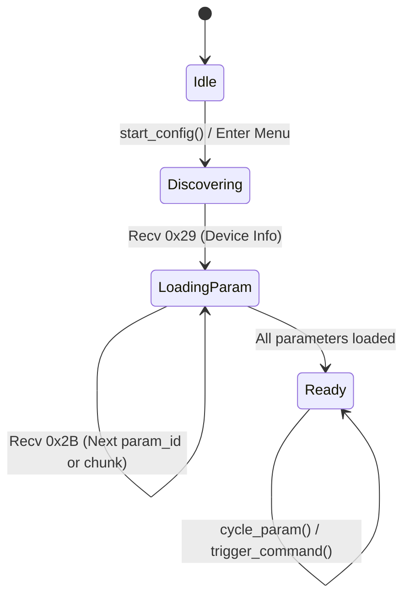

# CRSF / EXPRESSLRS PROTOCOL SPECIFICATION & VERIFICATION GUIDE

Technical reference and step-by-step verification walkthrough for the native Crossfire (CRSF) and ExpressLRS (ELRS) subsystem in the FlySky FS-i6X Rust firmware.

This guide provides the exact byte-level framing, timing intervals, CRC calculations, and state machine transitions implemented in [`src/crsf/`](../src/crsf/) to allow cross-referencing against the **TBS Crossfire Protocol Rev 08** and the **ExpressLRS parameter synchronization specification** by hand.

---

## 1. Framing & Wire Rules

All serial communication over USART2 (`PD5` TX / `PA15` RX) adheres strictly to the CRSF wire protocol:

```text
+----------------+----------------+----------------+--------------------------+----------+
| Dest Addr (1B) | Frame Len (1B) | Frame Type(1B) | Payload (Len - 2 Bytes)  | CRC8(1B) |
+----------------+----------------+----------------+--------------------------+----------+
```

### Protocol Fields

| Field | Length | Description |
| :--- | :---: | :--- |
| **`Dest Addr`** | 1 byte | Destination device address on the shared serial bus. |
| **`Frame Len`** | 1 byte | Total number of bytes following this byte (includes `Frame Type`, `Payload`, and `CRC8`). Total packet size on the wire is `Frame Len + 2`. |
| **`Frame Type`**| 1 byte | Identifier defining the payload structure and intent. |
| **`Payload`**   | Variable | Payload data specific to the frame type (`Frame Len - 2` bytes). |
| **`CRC8`**      | 1 byte | CRC-8 DVB-S2 checksum over `[Frame Type]` and `[Payload]`. |

### Device Addresses

| Identifier | Value | Description |
| :--- | :---: | :--- |
| `CRSF_ADDRESS_BROADCAST` | `0x00` | Universal broadcast target address |
| `CRSF_ADDRESS_RADIO_TRANSMITTER` | `0xEA` | Handset / Radio Transmitter (FS-i6X) |
| `CRSF_ADDRESS_CRSF_TRANSMITTER` | `0xEE` | External RF transmitter module (ExpressLRS / TBS Crossfire) |
| `CRSF_ADDRESS_CRSF_RECEIVER` | `0xEC` | Over-the-air RC receiver |
| `CRSF_ADDRESS_FLIGHT_CONTROLLER` | `0xC8` | Flight controller (Betaflight / INAV) |

### Checksum Calculation (`CRC8-DVB`)
- **Polynomial**: `0xD5` ($x^8 + x^7 + x^6 + x^4 + x^2 + 1$)
- **Initial Value**: `0x00`
- **Data Coverage**: Calculated strictly over `[Frame Type]` through the end of `[Payload]`.
- **Exclusions**: The first two bytes (`Dest Addr` and `Frame Len`) are **excluded** from the CRC.

Implemented in [`src/crsf/protocol.rs`](../src/crsf/protocol.rs#L90-L117).

### 11-Bit RC Channel Scaling Formula (`0x16`)
CRSF encodes 16 RC channels into 11-bit integers ($0..2047$) packed into 22 payload bytes. The channel conversion maps standard microsecond pulse widths ($988..\text{2012 µs}$) to standard CRSF endpoints:
- **Minimum (~988 µs)**: `172` counts
- **Neutral / Center (1500 µs)**: `992` counts
- **Maximum (~2012 µs)**: `1811` counts

Formula implemented in [`src/crsf/protocol.rs`](../src/crsf/protocol.rs#L122-L128):
$$\text{CRSF\_Value} = \left\lfloor\frac{(\text{clamped\_µs} - 988) \times 1639 + 512}{1024}\right\rfloor + 172$$

---

## 2. Configuration State Machine Lifecycle

The bare-metal configurator engine transitions through five states without dynamic heap allocation:



---

## 3. Step-by-Step Handshake Walkthrough

### Step 1: Module Discovery (`0x28` Device Ping)

When entering `9. Protocol Setup` -> `[Configure Module]`, `crsf::start_config()` is called:

1. **Engine State**: Transitions to `ElrsConfigState::Discovering`.
2. **Packet Built on Wire (`build_ping_frame`)**:
   ```text
   Byte 0: 0xEE  (Dest: External TX Module)
   Byte 1: 0x04  (Len: 4 bytes follow)
   Byte 2: 0x28  (Type: CRSF_FRAMETYPE_DEVICE_PING)
   Byte 3: 0x00  (Payload[0]: Target = Broadcast)
   Byte 4: 0xEA  (Payload[1]: Origin = Radio Transmitter)
   Byte 5: CRC   (crc8 over [0x28, 0x00, 0xEA] -> 0x8C)
   ```
   **Total Size**: 6 bytes.
3. **Transmission & Retry**: Transmitted over USART2. If no response arrives, `elrs_tick()` re-transmits every **300 ms**.

---

### Step 2: Module Response (`0x29` Device Info)

The external module responds with frame type `0x29` addressed to `0xEA`:

```text
[0xEA] [Len] [0x29] [0xEA] [0xEE] [Device Name\0] [Serial: 4B] [HW ID: 4B] [FW ID: 4B] [Param Count: 1B] [Param Ver: 1B] [CRC]
```

#### Parsing Breakdown in `handle_device_info_frame`:
1. `payload[0]` (`0xEA`): Destination match confirmation.
2. `payload[1]` (`0xEE`): Module physical address &rarr; cached as `CONFIG_ENGINE.device_id`.
3. `payload[2..]`: Reads null-terminated ASCII string &rarr; copied to `CONFIG_ENGINE.device_name` (e.g. `"ExpressLRS 2.4G"`).
4. **Parameter Count Offset Math**:
   ```text
   param_count_offset = offset_after_null + 4 (Serial) + 4 (Hardware ID) + 4 (Firmware ID);
   param_count = payload[param_count_offset];
   ```
5. **State Transition**: Sets `CONFIG_ENGINE.param_count`. Transitions immediately to `ElrsConfigState::LoadingParam(1)` and requests Parameter 1.

---

### Step 3: Parameter Tree Loading (`0x2C` Read & `0x2B` Entry)

Parameters are loaded sequentially from ID `1` up to `param_count` (cached up to `MAX_PARAMS = 16` to respect Cortex-M0 SRAM):

#### A. Request Frame (`0x2C` Parameter Read)
```text
Byte 0: 0xEE         (Dest: Module)
Byte 1: 0x06         (Len: 6)
Byte 2: 0x2C         (Type: CRSF_FRAMETYPE_PARAMETER_READ)
Byte 3: 0xEE         (Dest)
Byte 4: 0xEA         (Orig: Handset)
Byte 5: [Param ID]   (Parameter index: 1..N)
Byte 6: [Chunk]      (Chunk index: 0 for start of param)
Byte 7: CRC          (crc8 over bytes 2..6)
```
**Total Size**: 8 bytes.

#### B. Response Frame (`0x2B` Parameter Settings Entry)
```text
[0xEA] [Len] [0x2B] [0xEA] [0xEE] [Param ID] [Chunks Remain] [Chunk Payload...] [CRC]
```

#### C. Chunk Reassembly & Payload Structure:
Parameters exceeding the CRSF MTU (~56 bytes) are split across multiple frames. The handset accumulates chunk payloads into a 96-byte contiguous buffer (`CHUNK_BUF`) until `Chunks Remain == 0`:

1. `Parent ID` (1 byte, `0x00` = root)
2. `Type` (1 byte):
   - `0x09`: **`CRSF_TYPE_SELECT`** (Selection list, e.g. Packet Rate, Power)
   - `0x0D`: **`CRSF_TYPE_COMMAND`** (Action command, e.g. `[Bind]`, `[Wi-Fi Mode]`)
3. `Name` (Null-terminated ASCII string, e.g. `"Packet Rate\0"`)
4. Data field (dependent on `Type`):
   - **For `SELECT` (0x09)**:
     - Semicolon-delimited options string (e.g. `"50Hz;100Hz;250Hz;500Hz\0"`).
     - Followed by 1 byte: Current selection value index (0-indexed).
   - **For `COMMAND` (0x0D)**:
     - Followed by 1 byte: Command Status (`0` = Ready, `1` = Start, `2` = In Progress, `3` = Confirmation Needed, etc.).

#### D. Chunk Advancement & State Machine Progression:
- If `Chunks Remain > 0`: Appends chunk to `CHUNK_BUF`, increments `current_chunk`, and sends `0x2C` requesting `chunk + 1`.
- If `Chunks Remain == 0`: Parses the reassembled `CHUNK_BUF`.
  - If in `ElrsConfigState::LoadingParam(id)`: advances to `next_id = param_id + 1` until `param_count` or `MAX_PARAMS (16)` is reached, then enters `ElrsConfigState::Ready`.
  - If already in `ElrsConfigState::Ready` (e.g. during command execution or option change): updates the cached parameter and **remains in `Ready`**, preserving the active UI display.

---

### Step 4: Parameter Modification (`0x2D` Param Write for SELECT)

When the user selects an option parameter and presses **`[OK]`**:

1. **Index Increment (`cycle_param`)**:
   $$\text{new\_value} = (\text{current\_value} + 1) \pmod{\text{max\_value} + 1}$$
2. **Wire Frame (`build_param_write_frame`)**:
   ```text
   Byte 0: 0xEE         (Dest: Module)
   Byte 1: 0x06         (Len: 6)
   Byte 2: 0x2D         (Type: CRSF_FRAMETYPE_PARAMETER_WRITE)
   Byte 3: 0xEE         (Dest)
   Byte 4: 0xEA         (Orig: Handset)
   Byte 5: [Param ID]   (Target parameter ID)
   Byte 6: [New Value]  (New selection index)
   Byte 7: CRC          (crc8 over bytes 2..6)
   ```
3. The display updates immediately, and the module acknowledges by switching operating modes.

---

### Step 5: Command Handshake & Confirmation (`0x2D` for COMMAND)

Action commands (`[Bind]`, `[Wi-Fi Mode]`, `[BLE Joystick]`) execute through a stateful multi-step handshake:

```text
Handset (FS-i6X)                                   ELRS Module
       |                                                |
[User presses OK]                                       |
       | ----- Write (0x2D, Val=STATUS_START [1]) ----> |
       |                                                |
       | <---- Entry (0x2B, Status=CONFIRM_NEEDED [3]) -| (Optional)
[Modal: Run [Bind]?]                                    |
[User presses OK]                                       |
       | ----- Write (0x2D, Val=STATUS_CONFIRM [4]) --> |
       |                                                |
       | <---- Entry (0x2B, Status=PROGRESS [2]) -------|
[Render "[Executing...]"]                               |
       |                                                |
       | --(Every 250ms)-- Write (Val=POLL [6]) ------> |
       | <---------------- Entry (Status=PROGRESS [2]) -|
       |                                                |
       | <---------------- Entry (Status=READY [0]) ----|
[Render "[Bind]"]                                       |
```

#### Command Status Values

| Constant | Value | Description |
| :--- | :---: | :--- |
| `STATUS_READY` | `0` | Command is idle and ready for activation |
| `STATUS_START` | `1` | Handset request to trigger command execution |
| `STATUS_PROGRESS` | `2` | Module is actively running the task |
| `STATUS_CONFIRMATION_NEEDED` | `3` | Module requests pilot confirmation before proceeding |
| `STATUS_CONFIRM` | `4` | Pilot confirmed action via UI modal |
| `STATUS_CANCEL` | `5` | Pilot canceled action via UI modal |
| `STATUS_POLL` | `6` | Periodic status poll from handset |

#### Execution Phases:
1. **Trigger (`trigger_command`)**:
   - Handset sends `0x2D` with value `STATUS_START = 1`.
   - Transitions `active_cmd` to `Starting` with a 1500 ms response timeout.
2. **Confirmation Intercept (`WaitingConfirm`)**:
   - If module returns status `3` (`CONFIRMATION_NEEDED`), the screen draws an interactive modal: `"Run: [Bind]? [OK] Yes  [ESC] No"`.
   - Pressing `[OK]` sends `STATUS_CONFIRM = 4`.
   - Pressing `[ESC]` sends `STATUS_CANCEL = 5`.
3. **Execution & Polling (`Running`)**:
   - While module reports status `2` (`PROGRESS`), the screen renders `[Executing...]`.
   - Handset polls every **250 ms** with `STATUS_POLL = 6`.
   - An 8.0-second safety timeout protects against hung module states.
4. **Completion**:
   - Module returns status `0` (`READY`). Handset resets `active_cmd` to `Idle` and normal list navigation resumes.

---

## 4. Verification Cheat Sheet

| Frame Type | Hex Code | Total Wire Size | Direction | Primary Purpose |
| :--- | :---: | :---: | :---: | :--- |
| **`DEVICE_PING`** | `0x28` | 6 bytes | Radio &rarr; Module | Discovery ping to broadcast target |
| **`DEVICE_INFO`** | `0x29` | Variable (18–40B) | Module &rarr; Radio | Module identity, serial, hardware ID, param count |
| **`PARAMETER_READ`** | `0x2C` | 8 bytes | Radio &rarr; Module | Read parameter chunk by ID and chunk index |
| **`PARAMETER_SETTINGS_ENTRY`** | `0x2B` | Variable (8–50B) | Module &rarr; Radio | Parameter type, name, options string, value, status |
| **`PARAMETER_WRITE`**| `0x2D` | 8 bytes | Radio &rarr; Module | Update select value or step command execution |
| **`RC_CHANNELS_PACKED`** | `0x16` | 26 bytes | Radio &rarr; Module | 16-channel 11-bit packed RC stream at ~100 Hz |
| **`LINK_STATISTICS`** | `0x14` | 14 bytes | Module &rarr; Radio | Downlink telemetry (RSSI 1/2, LQ, SNR, Power, Antenna) |
| **`BATTERY_SENSOR`** | `0x08` | 12 bytes | Module &rarr; Radio | Flight pack voltage (0.1V), current (0.1A), capacity (mAh) |

---

## 5. Source Code Cross-Reference

- **Wire Serialization & CRC**: [`src/crsf/protocol.rs`](../src/crsf/protocol.rs)
- **Engine State Machine & Handshake**: [`src/crsf/mod.rs`](../src/crsf/mod.rs)
- **Hardware UART2 Driver & Power**: [`src/crsf/uart.rs`](../src/crsf/uart.rs)
- **LCD Menu & Modal Interface**: [`src/ui/menu/screens/elrs.rs`](../src/ui/menu/screens/elrs.rs)
