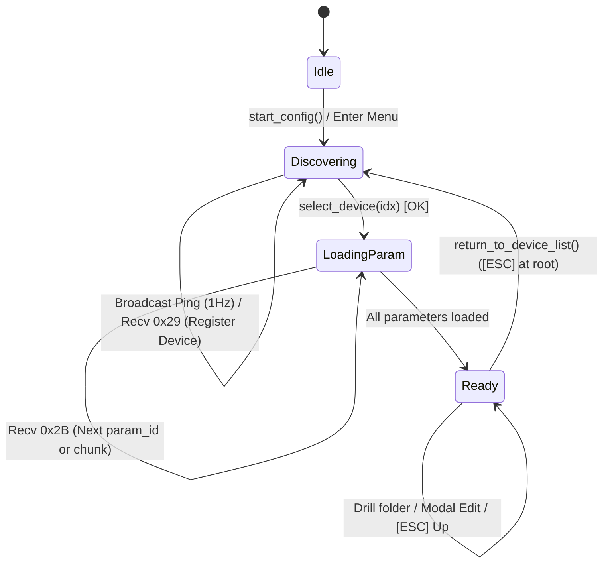

# CRSF / EXPRESSLRS PROTOCOL SPECIFICATION & VERIFICATION GUIDE

Technical reference and step-by-step verification walkthrough for the native Crossfire (CRSF) and ExpressLRS (ELRS) subsystem in the FlySky FS-i6X Rust firmware.

This guide provides the exact byte-level framing, timing intervals, CRC calculations, and state machine transitions implemented in [`src/crsf/`](../src/crsf/) to allow cross-referencing against the **TBS Crossfire Protocol Rev 08** and the **ExpressLRS parameter synchronization specification** by hand.

---

## 1. Framing & Wire Rules

All serial communication over USART2 (`PD5` TX / `PA15` RX) adheres strictly to the CRSF wire protocol:

```text
+----------------+----------------+----------------+--------------------------+----------+
| Dest Addr (1B) | Frame Len (1B) | Frame Type(1B) | Payload (Len - 2 Bytes)  | CRC8(1B) |
+----------------+----------------+----------------+--------------------------+----------+
```

### Protocol Fields

| Field | Length | Description |
| :--- | :---: | :--- |
| **`Dest Addr`** | 1 byte | Destination device address on the shared serial bus. |
| **`Frame Len`** | 1 byte | Total number of bytes following this byte (includes `Frame Type`, `Payload`, and `CRC8`). Total packet size on the wire is `Frame Len + 2`. |
| **`Frame Type`**| 1 byte | Identifier defining the payload structure and intent. |
| **`Payload`**   | Variable | Payload data specific to the frame type (`Frame Len - 2` bytes). |
| **`CRC8`**      | 1 byte | CRC-8 DVB-S2 checksum over `[Frame Type]` and `[Payload]`. |

### Device Addresses & Frame Sync

| Identifier | Value | Description |
| :--- | :---: | :--- |
| `CRSF_SYNC_BYTE` | `0xC8` | Serial frame sync byte for telemetry and response frames from module to handset (at `frame[0]`) |
| `CRSF_ADDRESS_BROADCAST` | `0x00` | Universal broadcast target address |
| `CRSF_ADDRESS_RADIO_TRANSMITTER` | `0xEA` | Handset / Radio Transmitter (FS-i6X) |
| `CRSF_ADDRESS_CRSF_TRANSMITTER` | `0xEE` | External RF transmitter module (ExpressLRS / TBS Crossfire) |
| `CRSF_ADDRESS_CRSF_RECEIVER` | `0xEC` | Over-the-air RC receiver |
| `CRSF_ADDRESS_FLIGHT_CONTROLLER` | `0xC8` | Flight controller (Betaflight / INAV) |

> [!NOTE]
> **Distinguishing `CRSF_SYNC_BYTE` vs `CRSF_ADDRESS_FLIGHT_CONTROLLER` (`0xC8`)**:
> Although both share the value `0xC8`, they are indexed and interpreted differently within a packet:
> - **Wire Byte 0 (`frame[0]`)**: Operates as the physical frame delimiter / sync header (`CRSF_SYNC_BYTE`) for all telemetry and extended response frames arriving from the external module over USART2 RX.
> - **Extended Frame Headers (`frame[3]` / `payload[0]` and `frame[4]` / `payload[1]`)**: In extended frames (`0x28`, `0x29`, `0x2B`, `0x2C`, `0x2D`), `frame[3]` is the Destination Address and `frame[4]` is the Origin Address. A packet from or to a flight controller contains `0xC8` (`CRSF_ADDRESS_FLIGHT_CONTROLLER`) at `frame[4]` or `frame[3]`, whereas local module frames arrive with `frame[4] = 0xEE` and receiver frames with `frame[4] = 0xEC`, all starting with `frame[0] = 0xC8`.
> - **Standard Telemetry Frames (`0x14`, `0x08`, `0x02`, `0x0B`)**: Start with `frame[0] = 0xC8` (`CRSF_SYNC_BYTE`), followed by length (`frame[1]`), type (`frame[2]`), and sensor payload directly at `frame[3..]` without destination or origin addresses.

### Checksum Calculation (`CRC8-DVB`)
- **Polynomial**: `0xD5` ($x^8 + x^7 + x^6 + x^4 + x^2 + 1$)
- **Initial Value**: `0x00`
- **Data Coverage**: Calculated strictly over `[Frame Type]` through the end of `[Payload]`.
- **Exclusions**: The first two bytes (`Dest Addr` and `Frame Len`) are **excluded** from the CRC.

Implemented in [`src/crsf/protocol.rs`](../src/crsf/protocol.rs#L90-L117).

### 11-Bit RC Channel Scaling Formula (`0x16`)
CRSF encodes 16 RC channels into 11-bit integers ($0..2047$) packed into 22 payload bytes. The channel conversion maps standard microsecond pulse widths ($988..\text{2012 µs}$) to standard CRSF endpoints:
- **Minimum (~988 µs)**: `172` counts
- **Neutral / Center (1500 µs)**: `992` counts
- **Maximum (~2012 µs)**: `1811` counts

Formula implemented in [`src/crsf/protocol.rs`](../src/crsf/protocol.rs#L122-L128):
$$\text{CRSF\_Value} = \left\lfloor\frac{(\text{clamped\_µs} - 988) \times 1639 + 512}{1024}\right\rfloor + 172$$

### Hardware UART & Real-Time Ingestion Architecture

At 420,000 baud, 1 byte arrives every **$23.8\,\mu\text{s}$**. The STM32F072 USART2 peripheral features only a 1-byte Receive Data Register (`RDR`) and **no hardware FIFO**. If CPU execution is occupied for $>47.6\,\mu\text{s}$ (such as drawing/flushing the ST7567 LCD at ~330 µs or ADC DMA handling), the hardware triggers an Overrun Error (`USART_ISR_ORE`), which silently drops subsequent bytes and truncates packets.

To eliminate data loss and guarantee high-speed stability:
1. **Interrupt-Driven Ring Buffer (`RXNEIE`)**: `USART2` is configured with receive interrupt enable (`RXNEIE` in `CR1`).
2. **128-Byte Atomic Ring Buffer**: Bytes are pushed into `RX_RING` inside the `USART2` interrupt handler in $< 1\,\mu\text{s}$.
3. **High NVIC Priority (`0x40`)**: IRQ 28 is unmasked with priority `0x40` (higher than TIM16/EXTI at `0x80` and USB at `0xC0`), guaranteeing preemption of any blocking loop tasks.
4. **Hardware ORE Auto-Recovery**: The ISR inspects and clears `USART_ISR_ORE` on every entry.
5. **Inter-Byte Silence Resynchronization**: If an electrical glitch or wire disconnect interrupts a packet mid-frame, `poll_telemetry()` tracks `LAST_RX_BYTE_MS`. If $\ge 3\text{ ms}$ elapses with an incomplete frame, `RX_LEN` automatically resets to 0 to resynchronize for the next frame.
7. **Configurable Baud Divisors & High-Speed Clocks**:
   - `420,000 baud`: $\text{BRR} = 114$ ($48\text{ MHz} / 420{,}000 = 114.28$)
   - `416,666 baud`: $\text{BRR} = 115$ ($48\text{ MHz} / 416{,}666.67 = 115.20$)
   - `115,200 baud`: $\text{BRR} = 417$ ($48\text{ MHz} / 115{,}200 = 416.66$)
   - `921,600 baud`: $\text{BRR} = 52$ ($48\text{ MHz} / 921{,}600 = 52.08$)
   - `1,875,000 baud`: $\text{BRR} = 26$ ($48\text{ MHz} / 1{,}875{,}000 = 25.6 \to 1{,}846{,}154\text{ bps}$, 1.5% timing margin)
8. **Single-Wire Half-Duplex (`HDSEL`) & Echo Suppression**:
   - When configured in Half-Duplex mode, `USART2_CR3` sets bit 3 (`HDSEL`).
   - Pin `PD5` operates in Alternate Function 0 (AF0), **Open-Drain** with internal Pull-Up. `PA15` is unconfigured.
   - To prevent self-reception corruption during channel packet transmissions, `write_bytes()` tracks transmitted byte count in `ECHO_SKIP_COUNT`, and the `USART2` interrupt handler drops exactly that number of self-echoed bytes from `RDR` before routing genuine inbound telemetry frames into `RX_RING`.

---

## 2. Configuration State Machine Lifecycle

The bare-metal configurator engine transitions through states without dynamic heap allocation, supporting TBS-Agent style multi-device auto-discovery, subfolder navigation, and modal option editing:


```mermaid
stateDiagram-v2
    [*] --> Idle
    Idle --> Discovering : start_config() / Enter Menu
    Discovering --> Discovering : Broadcast Ping (1Hz) / Recv 0x29 (Register Device)
    Discovering --> LoadingParam : select_device(idx) [OK]
    LoadingParam --> LoadingParam : Recv 0x2B (Next param_id or chunk)
    LoadingParam --> Ready : All parameters loaded
    Ready --> Ready : Drill folder / Modal Edit / [ESC] Up
    Ready --> Discovering : return_to_device_list() ([ESC] at root)
```

---

## 3. Step-by-Step Handshake Walkthrough

### Step 1: Bus Discovery (`0x28` Broadcast Ping)

When entering `9. Protocol Setup` -> `[Configure Module]`, `crsf::start_config()` is called:

1. **Engine State**: Transitions to `ElrsConfigState::Discovering`, resetting `devices_len = 0`.
2. **Packet Built on Wire (`build_ping_frame`)**:
   ```text
   Byte 0: 0xC8  (Sync: CRSF_SYNC_BYTE per TBS spec)
   Byte 1: 0x04  (Len: 4 bytes follow)
   Byte 2: 0x28  (Type: CRSF_FRAMETYPE_DEVICE_PING)
   Byte 3: 0x00  (Payload[0]: Target = Broadcast)
   Byte 4: 0xEA  (Payload[1]: Origin = Radio Transmitter)
   Byte 5: CRC   (crc8 over [0x28, 0x00, 0xEA] -> 0x54)
   ```
   **Total Size**: 6 bytes.
3. **Multi-Device Registration & Dynamic Pruning**: All online devices responding with `0x29 Device Info` (local transmitter module `0xEE`, remote receiver `0xEC`, flight controller `0xC8`, VTX, ESCs, etc.) are deduplicated and registered into `CONFIG_ENGINE.devices` (up to 16 devices). Devices that stop responding to 1 Hz pings for > 3000 ms (3 missed pings) are automatically pruned from the active list.
4. **Pacing**: `elrs_tick()` re-broadcasts the discovery ping every **1000 ms** (1 Hz), ensuring newly bound receivers or powered devices are discovered or pruned dynamically.

---

### Step 2: Device Selection (TBS-Agent Style Picker)

Instead of hardcoding or locking onto the local TX module, the handset renders a **Device Selection Screen** (`CRSF DEVICES`):
- Lists all discovered devices with their physical role tags: `[TX]`, `[RX]`, `[FC]`.
- Pilot navigates with `[UP]` / `[DOWN]`.
- Pressing `[OK]` calls `crsf::select_device(idx)`:
  - Sets `CONFIG_ENGINE.device_id` to the target address (`0xEE` or `0xEC`).
  - Sets `CONFIG_ENGINE.param_count` from the device's announcement.
  - Transitions to `ElrsConfigState::LoadingParam(1)`.
  - Dispatches `0x2C Parameter Read` for Param 1 Chunk 0 immediately.
- While configuring, broadcasts from other bus devices are safely ignored.
- Pressing `[ESC]` from root parameter view calls `crsf::return_to_device_list()`, returning smoothly to the device picker.

---

### Step 3: Parameter Tree Loading (`0x2C` Read & `0x2B` Entry)

Parameters are loaded on demand and cached in a unified memory layout:
- **Per-Folder Active Buffer**: Up to `MAX_PARAMS = 48` parameters for the currently active folder.
- **Device-Wide Param Map**: Up to `MAX_PARAM_MAP = 96` parameter IDs mapped to their parent folders.
- **Unified String Pool**: `STRING_POOL_SIZE = 1280` bytes (1.25 KB) storing names, options, and unit strings.

#### A. Request Frame (`0x2C` Parameter Read)
```text
Byte 0: 0xC8         (Sync: CRSF_SYNC_BYTE per TBS spec)
Byte 1: 0x06         (Len: 6)
Byte 2: 0x2C         (Type: CRSF_FRAMETYPE_PARAMETER_READ)
Byte 3: [Target]     (Dest: 0xEE for TX, 0xEC for RX, 0xC8 for FC)
Byte 4: 0xEA         (Orig: Handset)
Byte 5: [Param ID]   (Parameter index: 1..N)
Byte 6: [Chunk]      (Chunk index: 0 for start of param)
Byte 7: CRC          (crc8 over bytes 2..6)
```
**Total Size**: 8 bytes.

#### B. Response Frame (`0x2B` Parameter Settings Entry)
```text
[0xC8 (Sync)] [Len] [0x2B] [0xEA] [Orig] [Param ID] [Chunks Remain] [Chunk Payload...] [CRC]
```

#### C. Chunk Reassembly, Sequencing & Payload Structure:
Parameters exceeding the CRSF MTU (~56 bytes) are split across multiple frames. The handset validates chunk sequence order using `expect_chunks_remain` and accumulates chunk payloads into a 320-byte contiguous buffer (`CHUNK_BUF`) until `Chunks Remain == 0`:

1. `Parent ID` (1 byte, `0x00` = root)
2. `Type` (1 byte):
   - `0x00`: **`CRSF_TYPE_UINT8`** (Unsigned 8-bit integer, e.g. Output channel mapping)
   - `0x01`: **`CRSF_TYPE_INT8`** (Signed 8-bit integer)
   - `0x02`: **`CRSF_TYPE_UINT16`** (Unsigned 16-bit integer, big-endian)
   - `0x03`: **`CRSF_TYPE_INT16`** (Signed 16-bit integer, big-endian)
   - `0x09`: **`CRSF_TYPE_SELECT`** (Selection list, e.g. Packet Rate, Power)
   - `0x0B`: **`CRSF_TYPE_FOLDER`** (Subfolder grouping, e.g. `VTX Admin >`, `Wi-Fi Options >`)
   - `0x0C`: **`CRSF_TYPE_INFO`** / **`CRSF_TYPE_STRING`** (Read-only status string)
   - `0x0D`: **`CRSF_TYPE_COMMAND`** (Action command, e.g. `[Bind]`, `[Wi-Fi Mode]`)
3. `Name` (Null-terminated ASCII string, e.g. `"Packet Rate\0"` or `"Output 1\0"`)
4. Data field (dependent on `Type`):
   - **For Integer Types (`UINT8` / `INT8` / `UINT16` / `INT16`)**:
     - Followed by `[value, min, max, default]` (1 byte each for 8-bit, 2 bytes big-endian each for 16-bit).
     - Followed by null-terminated `unit` string (e.g. `"ch\0"`, `"mW\0"`, `"%\0"`), stored in the unified string pool.
   - **For `SELECT` (0x09)**:
     - Semicolon-delimited options string (stored in unified string pool, e.g. `"50Hz(-115dBm);100Hz Full(-112dBm);150Hz(-112dBm);250Hz(-108dBm);..."`).
     - Followed by 1 byte: Current selection value index (0-indexed).
   - **For `FOLDER` (0x0B)**:
     - Defines a submenu node. Children specify `parent = folder_id`.
   - **For `COMMAND` (0x0D)**:
     - Followed by 1 byte: Command Status (`0` = Ready, `1` = Start, `2` = In Progress, `3` = Confirmation Needed, etc.).

#### D. Immediate Query Dispatch, Timeout Recovery & State Machine Progression:
- **Immediate Query Dispatch**: To achieve maximum wire loading performance matching native TBS-Agent and ELRS Lua implementations, sequential requests and multi-chunk queries are transmitted immediately upon ingestion of the preceding chunk or parameter frame without artificial delays.
- **Chunk Sequencing**: Incoming chunks must match `expect_chunks_remain`. Stale or duplicate chunks from re-transmissions are safely discarded.
- **Timeout and Retries**: If no response arrives within **500 ms** (for local TX `0xEE`) or **1000 ms** (for remote receiver `0xEC`), `elrs_tick()` retries the request up to **4 times**. If retries are exhausted, the engine safely advances to `id + 1` immediately to prevent UI lockup.
- **Completion**: When `Chunks Remain == 0`:
  - Parses and stores the reassembled parameter.
  - If in `ElrsConfigState::LoadingParam(id)`: immediately requests `next_id = param_id + 1` until `param_count` or folder parameters are loaded, then enters `ElrsConfigState::Ready`.
  - If already in `ElrsConfigState::Ready`: updates the cached parameter and **remains in `Ready`**, preserving active UI display.

---

### Step 4: Hierarchical Folder Navigation & In-Place Modal Editing

#### A. Folder Navigation
- The UI filters parameters by `current_folder` (default `0` = root).
- Folder items render with a trailing chevron (`>`).
- Pressing `[OK]` on a `FOLDER` item sets `current_folder = folder.id`, immediately presenting child parameters.
- Pressing `[ESC]` ascends to the parent folder via `crsf::get_parent_folder(current_folder)`. Pressing `[ESC]` at root returns to the Device Picker.

#### B. Modal In-Place Parameter Editing
- Pressing `[OK]` on a `SELECT` parameter enters **Edit Mode** (`ctrl.editing = true`).
- The option displays with interactive brackets (`< 250Hz >`).
- `[UP]` / `[DOWN]` cycles the tentative value locally without sending serial traffic.
- Pressing `[OK]` commits the selection: transmits a `0x2D Param Write` frame to the module and exits edit mode.
- Pressing `[ESC]` cancels the edit without sending changes.

---

### Step 4: Parameter Modification (`0x2D` Param Write for SELECT)

When the user selects an option parameter and presses **`[OK]`**:

1. **Index Increment (`cycle_param`)**:
   $$\text{new\_value} = (\text{current\_value} + 1) \pmod{\text{max\_value} + 1}$$
2. **Wire Frame (`build_param_write_frame`)**:
   ```text
   Byte 0: 0xC8         (Sync: CRSF_SYNC_BYTE per TBS spec)
   Byte 1: 0x06         (Len: 6)
   Byte 2: 0x2D         (Type: CRSF_FRAMETYPE_PARAMETER_WRITE)
   Byte 3: [Target]     (Dest: 0xEE for TX, 0xEC for RX, 0xC8 for FC)
   Byte 4: 0xEA         (Orig: Handset)
   Byte 5: [Param ID]   (Target parameter ID)
   Byte 6: [New Value]  (New selection index)
   Byte 7: CRC          (crc8 over bytes 2..6)
   ```
3. The display updates immediately, and the module acknowledges by switching operating modes.

---

### Step 5: Command Handshake & Confirmation (`0x2D` for COMMAND)

Action commands (`[Bind]`, `[Wi-Fi Mode]`, `[BLE Joystick]`) execute through a stateful multi-step handshake:

```text
Handset (FS-i6X)                                   ELRS Module
       |                                                |
[User presses OK]                                       |
       | ----- Write (0x2D, Val=STATUS_START [1]) ----> |
       |                                                |
       | <---- Entry (0x2B, Status=CONFIRM_NEEDED [3]) -| (Optional)
[Modal: Run [Bind]?]                                    |
[User presses OK]                                       |
       | ----- Write (0x2D, Val=STATUS_CONFIRM [4]) --> |
       |                                                |
       | <---- Entry (0x2B, Status=PROGRESS [2]) -------|
[Render "[Executing...]"]                               |
       |                                                |
       | --(Every 250ms)-- Write (Val=POLL [6]) ------> |
       | <---------------- Entry (Status=PROGRESS [2]) -|
       |                                                |
       | <---------------- Entry (Status=READY [0]) ----|
[Render "[Bind]"]                                       |
```

#### Command Status Values

| Constant | Value | Description |
| :--- | :---: | :--- |
| `STATUS_READY` | `0` | Command is idle and ready for activation |
| `STATUS_START` | `1` | Handset request to trigger command execution |
| `STATUS_PROGRESS` | `2` | Module is actively running the task |
| `STATUS_CONFIRMATION_NEEDED` | `3` | Module requests pilot confirmation before proceeding |
| `STATUS_CONFIRM` | `4` | Pilot confirmed action via UI modal |
| `STATUS_CANCEL` | `5` | Pilot canceled action via UI modal |
| `STATUS_POLL` | `6` | Periodic status poll from handset |

#### Execution Phases:
1. **Trigger (`trigger_command`)**:
   - Handset sends `0x2D` with value `STATUS_START = 1`.
   - Transitions `active_cmd` to `Starting` with a 1500 ms response timeout.
2. **Confirmation Intercept (`WaitingConfirm`)**:
   - If module returns status `3` (`CONFIRMATION_NEEDED`), the screen draws an interactive modal: `"Run: [Bind]? [OK] Yes  [ESC] No"`.
   - Pressing `[OK]` sends `STATUS_CONFIRM = 4`.
   - Pressing `[ESC]` sends `STATUS_CANCEL = 5`.
3. **Execution & Polling (`Running`)**:
   - While module reports status `2` (`PROGRESS`), the screen renders `[Executing...]`.
   - Handset polls every **250 ms** with `STATUS_POLL = 6`.
   - An 8.0-second safety timeout protects against hung module states.
4. **Completion**:
   - Module returns status `0` (`READY`). Handset resets `active_cmd` to `Idle` and normal list navigation resumes.

---

## 4. Verification Cheat Sheet

| Frame Type | Hex Code | Total Wire Size | Direction | Primary Purpose |
| :--- | :---: | :---: | :---: | :--- |
| **`DEVICE_PING`** | `0x28` | 6 bytes | Radio &rarr; Module | Discovery ping to broadcast target |
| **`DEVICE_INFO`** | `0x29` | Variable (18–40B) | Module &rarr; Radio | Module identity, serial, hardware ID, param count |
| **`PARAMETER_READ`** | `0x2C` | 8 bytes | Radio &rarr; Module | Read parameter chunk by ID and chunk index |
| **`PARAMETER_SETTINGS_ENTRY`** | `0x2B` | Variable (8–50B) | Module &rarr; Radio | Parameter type, name, options string, value, status |
| **`PARAMETER_WRITE`**| `0x2D` | 8 bytes | Radio &rarr; Module | Update select value or step command execution |
| **`RC_CHANNELS_PACKED`** | `0x16` | 26 bytes | Radio &rarr; Module | 16-channel 11-bit packed RC stream at ~100 Hz |
| **`LINK_STATISTICS`** | `0x14` | 14 bytes | Module &rarr; Radio | Downlink telemetry (RSSI 1/2, LQ, SNR, Power, Antenna) |
| **`BATTERY_SENSOR`** | `0x08` | 12 bytes | Module &rarr; Radio | Flight pack voltage (0.1V), current (0.1A), capacity (mAh) |

---

## 5. Source Code Cross-Reference

- **Wire Serialization & CRC**: [`src/crsf/protocol.rs`](../src/crsf/protocol.rs)
- **Engine State Machine & Handshake**: [`src/crsf/mod.rs`](../src/crsf/mod.rs)
- **Hardware UART2 Driver & Power**: [`src/crsf/uart.rs`](../src/crsf/uart.rs)
- **LCD Menu & Modal Interface**: [`src/ui/menu/screens/elrs.rs`](../src/ui/menu/screens/elrs.rs)

---

## 6. Automated Testing & Verification Suite

The repository includes a comprehensive dual-target host testing suite executable via:
```bash
cargo test-host
```

### Coverage Highlights:
1. **RadioMaster RP2 Device Info Capture (`test_real_world_rp2_device_info_packet`)**:
   - Injects the exact 27-byte capture from an ExpressLRS receiver:
     `0xC8 0x19 0x29 0xEA 0xEE 0x52 0x4D 0x20 0x52 0x50 0x32 0x00 0x45 0x4C 0x52 0x53 0x00 0x00 0x00 0x00 0x00 0x04 0x00 0x00 0x15 0x00 0x0D`
   - Validates device name `"RM RP2"`, serial `"ELRS"`, firmware ID `4`, parameter count `21`, and transition to `LoadingParam(1)`.
   - Validates outbound response matches specification: `[0xC8, 0x06, 0x2C, 0xEE, 0xEA, 0x01, 0x00, 0x86]`.
2. **Dynamic Target Addressing (`test_dynamic_target_addressing`)**:
   - Verifies wire destination byte 0 is always `CRSF_SYNC_BYTE` (`0xC8`) and payload byte 3 dynamically matches `target` for `0xEE`, `0xEC`, and `0xC8`.
3. **Receiver Address Filter Acceptance (`test_rx_accepts_receiver_address_0xec`)**:
   - Verifies incoming frames addressed to `0xEC` (`CRSF_ADDRESS_CRSF_RECEIVER`) are ingested into `RX_BUF` rather than rejected.
4. **Inter-Byte Timeout Resynchronization (`test_inter_byte_timeout_resync`)**:
   - Verifies truncated partial frames hold during short pauses (<3 ms) and reset cleanly after $\ge 3\text{ ms}$ of bus silence, allowing the next valid frame to parse with 100% fidelity.

For full architectural details on dual-target execution, mock serial FIFOs, and deterministic timeout simulation, see the **[Testing Methodology & Verification Guide](TESTING.md)**.


