# ARCHITECTURE & PERFORMANCE COMPARISON: FLYSKY-I6X-RS VS. OPENI6X VS. STOCK FIRMWARE

A comprehensive technical and operational comparison between **`flysky-i6x-rs`**, **`OpenI6X`** (OpenTX port for the FS-i6X), and the **Stock FlySky FS-i6X Firmware**.

This document is written for pilots and developers evaluating whether to migrate from stock firmware or OpenI6X to `flysky-i6x-rs`.

---

## 1. Executive Summary

The FlySky FS-i6X is an entry-level radio driven by an **ARM Cortex-M0 microcontroller (STM32F072VB / APM32F072VB)** clocked at 48 MHz with **128 KB Flash ROM** and **16 KB SRAM**.

- **The Stock Firmware** is closed-source, limited to 6–10 channels, offers minimal customization, and uses a non-deterministic polling loop with ~15–25 ms latency.
- **OpenI6X** is an ambitious community port of OpenTX 2.3/2.4. OpenTX is a desktop-class, monolithic C++ operating system designed for 32-bit Cortex-M3/M4 radios with 512 KB–2 MB Flash (e.g. FrSky Taranis, RadioMaster TX16S). Porting it to the Cortex-M0 required aggressively stripping features (removing voice prompts, SD cards, Lua scripting, and model memory slots). Despite this, **OpenI6X consumes ~121 KB of the 128 KB Flash (&gt;94.5% capacity)**, leaving less than 7 KB of headroom.
- **`flysky-i6x-rs`** is a clean-slate, bare-metal rewrite in **`no_std` Rust**. Rather than shoehorning a heavy OS into a small chip, it was built specifically for the FS-i6X hardware. It delivers hard real-time determinism, sub-4ms stick-to-air latency, modern hardware safety locks, 20 full model memories, 14-channel matrix mixer with aircraft templates, D/R & Expo, LCD contrast adjustment, dedicated 4-page telemetry dashboard, and comprehensive diagnostics while consuming **only ~52.9 KB of Flash (~41.3%)**, leaving **over 75 KB of Flash (>58%) free**.

---

## 2. Head-to-Head Comparison Matrix

| Technical Feature | Stock FlySky Firmware | OpenI6X (OpenTX 2.3/2.4 Port) | `flysky-i6x-rs` (Bare-Metal Rust) |
| :--- | :--- | :--- | :--- |
| **Language & Safety** | Proprietary C (Closed) | C++ (er9x/OpenTX lineage, raw pointers) | **100% `no_std` Rust (Memory-safe, 0 heap)** |
| **Flash Memory Usage** | ~65 KB / 128 KB (~50%) | **~121 KB / 128 KB (94.5%)** | **52.9 KB / 128 KB (41.3%)** |
| **Free Flash Headroom** | ~63 KB | **< 7 KB (< 5.5% free)** | **> 75 KB (> 58% free)** |
| **SRAM Consumption** | ~6 KB / 16 KB | ~12.5–13.5 KB / 16 KB | **236 bytes static + 1 KB LCD (>90% free)** |
| **Boot Time to RF Link** | ~1.5 seconds | ~2.5–3.5 seconds (Splash screen) | **< 30 milliseconds (Instantaneous)** |
| **Stick-to-Antenna Latency** | 15–25 ms | 9–14 ms (Multi-layer mixer pipeline) | **< 3.85 ms (Direct DMA-to-RF pass-through)** |
| **RF Packet Timing Sync** | Soft loop polling (jittery) | Soft mixer loop + hardware timer | **Hardware `TIM16` exact 3850.0 µs frame sync** |
| **Channels Supported** | 6 (stock) / 10 (modded) | Up to 14 channels (AFHDS 2A) | **14 channels full resolution (1000–2000 µs)** |
| **Matrix Mixer & Templates** | Basic fixed mixing | OpenTX matrix mixer | **8 freeform mix lines + Elevon/V-Tail/Flaperon** |
| **Model Memory Storage** | 20 basic models | Severely limited (~4–8 stripped slots) | **20 independent 128-byte profiles in Flash** |
| **Curves & Smoothing** | Fixed 5-point linear | Multi-point linear interpolation | **Switchable 5/9-point + Catmull-Rom spline** |
| **Throttle Trim Safety Lock** | None (Active at all times) | Manual model mixer setting needed | **Built-in 3-mode safety lock (Lock/Idle/Linear)** |
| **Backlight Dimming Mod** | Not supported (On/Off only) | Requires custom build flag (`PC9`) | **Universal out-of-the-box (TIM3_CH4 1 kHz PWM)** |
| **Backlight Auto-Timeout** | None | Configurable | **15s / 30s / 60s / Always On with stick wake** |
| **LCD Contrast Adjustment** | None | Limited | **Electronic Volume (EV) contrast (15..55)** |
| **Digital Trims** | Standard digital trims | OpenTX trim routing | **Single-click + 90ms auto-repeat + audio pitch** |
| **Audio Feedback** | Basic piezo beeps | Basic buzzer tones | **Frequency-scaled pitch & center confirmation** |
| **Interactive Calibration** | Factory calibration menu | 2-page calibration | **2-step guided wizard with physical travel scaling** |
| **Live Diagnostics** | Basic display | Channel monitor / Diag Anas | **4-Page Dash: Gimbals, 14-CH, Model, Telemetry** |
| **DFU Recovery Method** | Factory USB cable only | Bootloader mode | **Inward Trims shortcut + Hardware R53 pad** |

---

## 3. Flash Memory & The Headroom Crisis in OpenI6X

### The OpenI6X Bottleneck
OpenI6X is an impressive feat of optimization, but it is fundamentally limited by the heritage of the OpenTX codebase:
1. **Desktop-Class C++ Abstractions**: Virtual method tables (vtables), class hierarchies, and multi-file preprocessor cascades designed for full-color Horus/Taranis systems cannot be fully stripped away.
2. **Flash Starvation**: With ~121 KB of Flash consumed, developers cannot add new telemetry protocols (such as full ELRS/Crossfire telemetry parsing or custom mixers) without deleting existing code.
3. **Compiler Risk**: OpenI6X binaries must be compiled with aggressive link-time optimization (`-flto`) and space optimization (`-Os`), where tiny changes in code structure can cause the linker to overflow the 128 KB boundary (`region 'FLASH' overflowed by N bytes`).

### The `flysky-i6x-rs` Advantage
`flysky-i6x-rs` is built from scratch without legacy code:

| Firmware | Flash Used | Flash Free | Status |
| :--- | :--- | :--- | :--- |
| **`flysky-i6x-rs`** | **52.9 KB (41.3%)** | **~75.1 KB (58.7%)** | **Massive Headroom for Features** |
| **Stock Firmware** | ~65 KB (50.8%) | ~63 KB (49.2%) | Closed Source / No Expansion |
| **OpenI6X** | **121 KB (94.5%)** | **< 7 KB (< 5.5%)** | **Flash Starvation (Near Limit)** |

- **Over 75 KB of Free Flash Headroom** allows massive future expansion:
  - Multi-model storage profiles (20 slots supported).
  - Dual Rates, Expo, and 8-rule freeform matrix mixing with templates.
  - Native CRSF / ELRS serial transmitter support via USART2 (`PD5`/`PA15`).
  - Full telemetry sensor decoding (GPS coordinates, altitude, battery current, fuel capacity).

---

## 4. Real-Time Concurrency & Air Latency

### Latency Pipeline Comparison

```mermaid
flowchart TD
    subgraph Stock ["Stock FlySky Firmware (15–25 ms Latency)"]
        S1["Physical Sticks"] --> S2["ADC Polling Loop"] --> S3["Software Mixer"] --> S4["Software Wait Loop"] --> S5["A7105 Tx"]
    end

    subgraph OpenI6X ["OpenI6X / OpenTX Port (9–14 ms Latency)"]
        O1["Physical Sticks"] --> O2["OpenTX ADC Driver"] --> O3["MMA Jitter Filter"] --> O4["Mixer Task (RTOS)"] --> O5["PXX / AFHDS Task"] --> O6["SPI FIFO Tx"]
    end

    subgraph RustFW ["flysky-i6x-rs (&lt; 3.85 ms Deterministic Latency)"]
        R1["Physical Sticks"] --> R2["Autonomous DMA1 Scan (0.23 ms)"] --> R3["Zero-Latency MMA Filter"] --> R4["Atomic PENDING Buffer"] --> R5["TIM16 260 Hz ISR (Direct SPI1 Tx)"]
    end
```



1. **Continuous Circular DMA**: In `flysky-i6x-rs`, the ADC1 peripheral automatically scans all 11 analog channels into SRAM in **0.23 ms** using DMA1 Channel 1. No CPU cycles are wasted waiting for ADC conversions.
2. **Micro-Jitter Filter with Zero Latency**: The Modified Moving Average (MMA) filter applies filtering to minor noise (&lt; 20 counts), but passes stick motions (&gt; 20 counts) through with **0 delay**.
3. **TIM16 Hardware Frame Sync**: A dedicated 48 MHz hardware timer (`PSC = 47`, `ARR = 3849`) fires an interrupt every **3850.0 µs (259.74 Hz)**. Every single packet transmitted carries fresh stick data calculated less than 2 ms prior.

---

## 5. Safety Systems & Flight Controller Integration

### Throttle Trim Safety Lock (Option 2)
In modern quadcopters and fixed-wing planes running Betaflight, INAV, or ArduPilot, flight controllers expect the throttle channel to sit at an exact known microsecond value (typically 1000 µs) when disarmed.

- **The Problem in Stock & OpenI6X**:
  Accidentally bumping the Throttle Trim rocker switch downwards lowers the throttle pulse below 1000 µs (e.g. 950 µs). On Betaflight/INAV, this can trigger an unintentional Failsafe or prevent the drone from arming. Bumping it upwards can cause motors to spin immediately upon arming.
- **The Solution in `flysky-i6x-rs`**:
  `flysky-i6x-rs` implements **Configurable Throttle Trim Safety Modes**:
  - By default, throttle trim adjustment is **locked out** (`OFF (Lock)`). Bumping the throttle rocker produces an audible warning tone without changing the throttle output, protecting modern flight controllers from unintentional disarm or motor spins.
  - Pilots flying traditional glow/gas fixed-wing aircraft can set Throttle Trim to **`IDLE`** (adjusts idle/cutoff below 50% throttle without altering full-throttle travel) or **`LINEAR`** in the scrollable `Radio Setup` menu, where the setting is persisted to Flash.

---

## 6. Hardware Backlight Dimming Mod

A very popular hardware mod for the FlySky FS-i6X is soldering a jumper wire from the unpopulated `PC9` pad on the motherboard to the backlight transistor base pad (`BL`).

### The Dangerous `PB1` Mistake in Older OpenTX Docs
Older community guides for OpenI6X suggested soldering to `PB1`. However, hardware tracing confirms:
> **`PB1` is physically wired to Switch SD (ADC Channel 9).**
> If firmware drives `PB1` as an output, flipping Switch SD to the DOWN position creates a dead-short directly to ground, dragging down the 3.3V rail and causing microcontroller brownout resets!

### Universal Backlight Driver in `flysky-i6x-rs`
`flysky-i6x-rs` includes built-in, out-of-the-box support for both stock and modded hardware:
- **Pin `PC9`** is configured as Alternate Function 0 (`TIM3_CH4`) running **1 kHz hardware PWM**.
- **Pin `PF3`** is simultaneously controlled for stock unmodded factory backlight switching.
- **Unified Controls**: In the scrollable `Radio Setup` menu, pilots can adjust backlight brightness from **10% to 100%** in 10% steps, configure auto-timeout (**Always On, 15s, 30s, 60s**), adjust LCD contrast (**20..50**), and configure battery alarm threshold (**4.0V..5.0V**).
- When a timeout is configured, any key press or stick movement (> 30 ADC counts) immediately wakes the display.

---

## 7. Guided Endpoint Calibration vs. Raw ADC

A common complaint with stock firmware and OpenI6X is unclear stick calibration where bars stop short of the screen edges or require guesswork.

### Potentiometer Physical Mechanics
- The STM32 12-bit ADC spans `0..4095` counts (0.0V..3.3V).
- Gimbal potentiometers have a 270° electrical track, but the transmitter stick physically only tilts ±25° (50° total).
- The wiper voltage physically swings only between approx 0.35V and approx 2.95V (~380..3720 counts). The hardware physically cannot produce 0 or 4095.
- Rotary pots `VRA` and `VRB` have series voltage divider resistors and swing ~800..3300 counts.

### `flysky-i6x-rs` Guided Calibration Wizard
- **Step 1 (Neutral Center)**: User centers sticks, sets throttle to 50%, and centers pots. Pressing `[OK]` captures resting neutral points.
- **Step 2 (Limit Capture)**: User stirs sticks and turns pots. The display renders symmetric 30-pixel inner boxes with dynamic deflection scaling:
  - Horizontal sticks (`A`, `R`) reach full travel at 1350 counts.
  - Vertical sticks (`E`, `T`) reach full travel at 1250 counts.
  - Rotary pots (`V1`, `V2`) reach full travel at 900 counts.
- **OpenTX Tolerance Margin**: Applies exact `(span * 63) / 64` (~1.6% margin matching OpenTX `STICK_TOLERANCE 64`) so that ±100% channel travel is reached at the mechanical bezel stop without straining gimbal arms.

---

## 8. Diagnostics & Transparency

`flysky-i6x-rs` provides tools previously unavailable or deeply buried in submenus:

1. **Channel Monitor**:
   - Live 14-channel view showing graphical progress bars and exact microsecond pulse readouts (1000..2000 µs).
2. **Analog Diagnostics (`Diag Anas`)**:
   - Live numerical display of the raw 12-bit ADC values (0..4095) for all 11 pins:
     - Gimbals: `RH` (PA0), `RV` (PA1), `LV` (PA2), `LH` (PA3)
     - Pots: `V1` (PA6), `V2` (PA7)
     - Switches: `SA` (PA4), `SB` (PA5), `SC` (PB0), `SD` (PB1) with decoded `U` / `M` / `D` states.
     - Battery: `BT` (PC0) raw count and calibrated voltage in millivolts.

---

## 9. Migration & Transition Guide

### Why Migrate from Stock Firmware?
- **Unlock 14 Channels**: Transmit up to 14 channels via AFHDS 2A to receivers like FS-iA6B or FS-iA10B via i-BUS.
- **Sub-4ms Air Latency**: Far crisper, more connected stick feel for FPV drones and aerobatic aircraft.
- **Backlight Dimming**: Modern PWM brightness and auto-shutoff.
- **Full Calibration Control**: Custom endpoint capture with Flash persistence.

### Why Migrate from OpenI6X?
- **Massive Headroom**: Eliminate the 94.5% Flash starvation barrier.
- **Rock-Solid Reliability**: Clean-slate Rust code eliminates potential stack overflows and memory corruption risks present in stripped-down C++ ports.
- **Instant Boot**: Radio turns on and links to your aircraft in < 30 ms instead of waiting for a 3-second splash screen.
- **Direct Safety Controls**: Built-in throttle safety lock prevents accidental disarm issues on Betaflight/INAV.

### How to Flash & Switch
1. **Enter DFU Bootloader**:
   - Push **Roll Left** and **Yaw Right** trim rockers inward while powering on.
   - Or hold the **BIND** button while powering on.
2. **Flash Binary**:
   ```bash
   dfu-util -a0 -s 0x08000000:leave -d 0483:df11 -D target/flysky-i6x-rs.bin
   ```
3. **Reverting**:
   Because the ST factory bootloader is stored in permanent ROM, you can revert back to OpenI6X or stock firmware anytime via USB:
   ```bash
   dfu-util -a0 -s 0x08000000:leave -d 0483:df11 -D opentx_backup.bin
   ```
