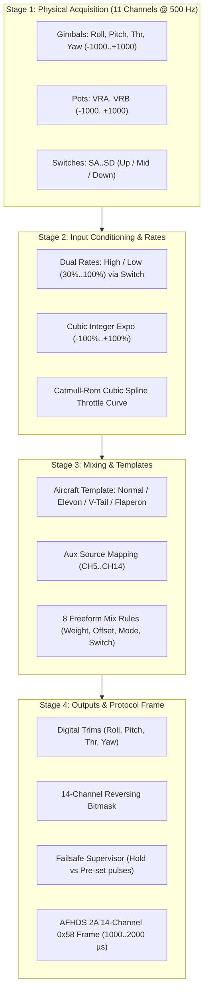

# FLIGHT CONTROL & 14-CHANNEL MIXING ARCHITECTURE

Comprehensive reference for input conditioning (Dual Rates & Exponential), auxiliary channel assignment, built-in wing and tail templates, and the EdgeTX/OpenTX-inspired 14-channel freeform matrix mixer on the FlySky FS-i6X.

---

## 1. Overview & Control Pipeline

The mixing system in `flysky-i6x-rs` implements an interrupt-safe, deterministic, zero-heap 4-stage pipeline that runs every main execution cycle (~500 Hz):



---

## 2. Input Conditioning: Dual Rates & Cubic Exponential

Before raw gimbal movements reach the mixer matrix, primary flight controls (Aileron, Elevator, Rudder) are conditioned with user-configurable **Dual Rates (D/R)** and **Exponential Curves (EXPO)**.

### Mathematical Formulation (Integer Arithmetic)
To ensure deterministic execution without floating-point emulation overhead on the Cortex-M0 core, exponential curves are computed using an exact integer cubic polynomial.

Given a normalized stick input `x` in the range `[-1000, +1000]` and active rate percentage `R` in `[30, 100]%`:

```text
x_scaled = (x * R) / 100
```

Let the normalized cubic component be:

```text
x_cubic = (x_scaled^3) / 1,000,000   (in range [-1000, +1000])
```

1. **Positive Expo (Expo > 0): Softens Center Sensitivity**
   Decreases stick sensitivity around the neutral stick position for smooth scale flying, while retaining 100% mechanical throw at gimbal endpoints:
   ```text
   Output = (x_scaled * (100 - Expo) + x_cubic * Expo) / 100
   ```

2. **Negative Expo (Expo < 0): Heightens Center Sensitivity**
   Increases stick sensitivity near center for aggressive 3D aerobatic maneuvers:
   ```text
   Output = x_scaled + ((x_scaled - x_cubic) * |Expo|) / 100
   ```

Implemented in [`src/mixer.rs`](../src/mixer.rs#L44-L64).

### D/R Switch Assignment
In the **Dual Rate / Expo** menu, the pilot selects an assigned hardware switch:
- `None`: High rate always active.
- `SA`: 2-position switch (UP = High Rate, DOWN = Low Rate).
- `SB`: 3-position switch (UP = High Rate, MID/DOWN = Low Rate).
- `SC`: 3-position switch (UP = High Rate, MID/DOWN = Low Rate).
- `SD`: 2-position switch (UP = High Rate, DOWN = Low Rate).

Independent High and Low rates (30%..100%) and Expo (-100%..+100%) can be configured per channel (Roll, Pitch, and Yaw).

---

## 3. Wing & Tail Aircraft Templates

For standard aircraft configurations, the firmware provides pre-configured wing and tail templates that automatically route and mix the conditioned stick inputs into the output matrix:

### 1. Normal (Standard 4-Channel)
- **CH1**: Roll / Aileron (Right Gimbal Horizontal)
- **CH2**: Pitch / Elevator (Right Gimbal Vertical)
- **CH3**: Throttle (Left Gimbal Vertical with Catmull-Rom spline curve)
- **CH4**: Yaw / Rudder (Left Gimbal Horizontal)

### 2. Elevon / Delta Wing (Flying Wings & Pusher Jets)
Combines Elevator and Aileron into two elevon surfaces on the trailing edge of the wing:
```text
CH1 (Left Elevon)  = (Pitch - Roll) / 2
CH2 (Right Elevon) = (Pitch + Roll) / 2
```
- When pulling back on the pitch stick (Up Elevator), both surfaces raise together.
- When deflecting the roll stick right, the right elevon raises and left elevon lowers.

### 3. V-Tail (V-Tail Gliders & Scale Planes)
Combines Elevator and Rudder into two angled tail surfaces:
```text
CH2 (Left V-Tail)  = (Pitch + Yaw) / 2
CH4 (Right V-Tail) = (Pitch - Yaw) / 2
```
- **CH1**: Standard Aileron control.
- When pulling back on pitch, both V-tail surfaces deflect upward.
- When yawing right, the left surface moves up and right surface moves down.

### 4. Flaperon (Dual Ailerons with Integrated Flaps)
Controls two independent wing servos for full-span ailerons and camber/flap control:
```text
CH1 (Left Aileron)  = Roll + (Flap / 2)
CH6 (Right Aileron) = -Roll + (Flap / 2)
```
- Flap deployment is driven by the physical source assigned to **CH6** in the `Aux Channels` menu (e.g. switch `SB` for 3-position flaps, or rotary knob `VRA` for variable camber).

---

## 4. Auxiliary Channel Remapping (CH5..CH14)

All 10 auxiliary channels (CH5 through CH14) can be independently assigned to any physical control on the radio from the `Aux Channels` menu:

| Source ID | Label | Description | Output Range |
| :--- | :--- | :--- | :--- |
| **0** | `None` | Neutral output (no input source) | 1500 µs |
| **1** | `Roll` | Conditioned Aileron stick input | 1000..2000 µs |
| **2** | `Pitch`| Conditioned Elevator stick input | 1000..2000 µs |
| **3** | `Thr`  | Spline-curved Throttle stick input | 1000..2000 µs |
| **4** | `Yaw`  | Conditioned Rudder stick input | 1000..2000 µs |
| **5** | `VRA`  | Left rotary dial potentiometer | 1000..2000 µs |
| **6** | `VRB`  | Right rotary dial potentiometer | 1000..2000 µs |
| **7** | `SA`   | 2-position toggle switch | UP: 1000 µs / DN: 2000 µs |
| **8** | `SB`   | 3-position toggle switch | UP: 1000 µs / MID: 1500 µs / DN: 2000 µs |
| **9** | `SC`   | 3-position toggle switch | UP: 1000 µs / MID: 1500 µs / DN: 2000 µs |
| **10**| `SD`   | 2-position toggle switch | UP: 1000 µs / DN: 2000 µs |

### Factory Default Auxiliary Mapping
- `CH5`: **SA** (Arming switch / Flight mode)
- `CH6`: **SB** (3-position flight modes: Angle / Horizon / Acro)
- `CH7`: **VRA** (Gimbal tilt / Camber flap)
- `CH8`: **VRB** (Payload release / Volume)
- `CH9`: **SC** (3-position auxiliary: Beeper / OSD switch)
- `CH10`: **SD** (Throttle cut / Rescue switch)
- `CH11..CH14`: `None` (Centered 1500 µs)

---

## 5. Freeform Matrix Mixer Engine

For custom aircraft geometries, complex sailplanes, multi-engine craft, and safety interlocks, every model profile includes **8 freeform mix lines** (`Mix 1` through `Mix 8`).

### Mix Rule Parameters
Each mix line comprises a compact 6-byte struct stored in Flash memory:

```rust
pub struct MixLine {
    pub target_ch: u8,   // 0: Disabled, 1..14: Target Channel (CH1..CH14)
    pub source: u8,      // 0: None, 1..4: AETR, 5..6: VRA/VRB, 7..10: SA..SD, 11: MAX, 12..25: CH1..CH14
    pub weight: i8,      // -100% .. +100% (gain / authority)
    pub offset: i8,      // -100% .. +100% (center shift)
    pub switch: u8,      // 0: Always ON, 1..10: Physical switch position condition
    pub mode: u8,        // 0: ADD (+), 1: MULTIPLY (*), 2: REPLACE (:=)
}
```

### Multiplex Modes
When a mix line is active, it modifies the target channel based on its configured mode:
1. **`ADD (+)`**: Adds the weighted source to the current channel value:
   ```text
   Channel_new = Channel_current + ((Source * Weight) / 100) + (Offset * 10)
   ```
2. **`MULTIPLY (*)`**: Scales the current channel value by the source (e.g. gain knobs, variable differential):
   ```text
   Channel_new = (Channel_current * Term) / 1000
   ```
3. **`REPLACE (:=)`**: Overrides and replaces the target channel completely (e.g. throttle cut, emergency level/rescue switch):
   ```text
   Channel_new = ((Source * Weight) / 100) + (Offset * 10)
   ```

### Switch Conditions
A mix line can be gated by a hardware switch:
- `ON`: Always active.
- `SA^`, `SAv`: Active when switch `SA` is UP or DOWN.
- `SB^`, `SB-`, `SBv`: Active when switch `SB` is UP, MID, or DOWN.
- `SC^`, `SC-`, `SCv`: Active when switch `SC` is UP, MID, or DOWN.
- `SD^`, `SDv`: Active when switch `SD` is UP or DOWN.

---

## 6. Practical EdgeTX / OpenTX Mixer Recipes

Here are proven mixer setups used by RC pilots:

### Recipe 1: Throttle Cut Safety Switch
*Prevents accidental motor start by locking CH3 to minimum pulse (1000 µs) whenever switch `SD` is flipped DOWN:*
- **Target**: `CH3`
- **Source**: `MAX`
- **Weight**: `-100%`
- **Offset**: `0%`
- **Switch**: `SDv`
- **Mode**: `REPLACE (:=)`

### Recipe 2: Throttle-to-Elevator Pitch Compensation
*High-thrust airplanes often balloon upward when applying full throttle. This mix automatically injects a small amount of down-elevator as throttle increases:*
- **Target**: `CH2` (Elevator)
- **Source**: `Thr`
- **Weight**: `-10%`
- **Offset**: `0%`
- **Switch**: `ON`
- **Mode**: `ADD (+)`

### Recipe 3: Twin-Engine Differential Thrust
*Twin-motor planes or boats can spin tightly using motor thrust mixed with rudder:*
- **CH3 (Left Motor)**: Driven by normal throttle.
- **CH5 (Right Motor)**: In `Aux Channels`, set source to `Thr`.
- **Mix 1 (Left Motor Yaw Mix)**:
  - Target: `CH3`, Source: `Yaw`, Weight: `+20%`, Mode: `ADD (+)`
- **Mix 2 (Right Motor Yaw Mix)**:
  - Target: `CH5`, Source: `Yaw`, Weight: `-20%`, Mode: `ADD (+)`

### Recipe 4: Crow / Butterfly Sailplane Airbrakes
*For high-performance gliders: deploys flaps full down, raises both ailerons up, and feeds in down-elevator compensation to dive without gaining speed:*
- **Template**: `Flaperon` (CH1 Left Aileron, CH6 Right Aileron).
- **Mix 1 (Flap-to-Aileron Crow)**:
  - Target: `CH1`, Source: `VRA`, Weight: `+40%`, Mode: `ADD (+)`
- **Mix 2 (Elevator Compensation)**:
  - Target: `CH2`, Source: `VRA`, Weight: `-15%`, Mode: `ADD (+)`

---

## 7. Storage & Flash Memory Budget

All Phase 10 flight mixer parameters are stored directly inside each 128-byte [`ModelConfig`](../src/storage.rs) structure in the append-only sequential storage log (Keys 1..20 across Flash Pages 60–63 at `0x0801_E000`):

| Parameter | Type | Bytes | Offset in Model Profile |
| :--- | :--- | :--- | :--- |
| `dr_switch` | `u8` | 1 | Offset 22 |
| `dr_high` | `[u8; 3]` | 3 | Offset 34..37 |
| `dr_low` | `[u8; 3]` | 3 | Offset 37..40 |
| `expo_high` | `[i8; 3]` | 3 | Offset 40..43 |
| `expo_low` | `[i8; 3]` | 3 | Offset 43..46 |
| `aux_channels` | `[u8; 10]` | 10 | Offset 52..62 |
| `wing_tail_mix` | `u8` | 1 | Offset 62 |
| `template_diff` | `i8` | 1 | Offset 63 |
| `mixes` | `[MixLine; 8]` | 48 | Offset 64..112 |
| `_reserved` | `[u8; 14]` | 14 | Offset 114..128 |

Total `ModelConfig` size: **exactly 128 bytes** (100% backward and forward compatible, 0 migration loss).
Total firmware binary size: **52.9 KB** / 128 KB (~58% Flash headroom remaining).
