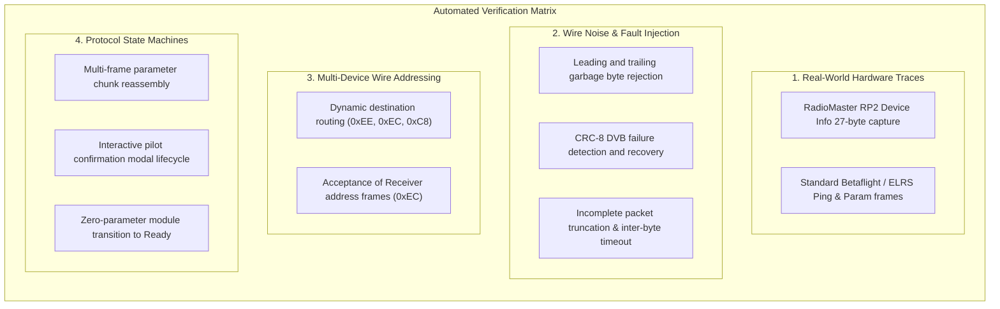

# Testing Methodology & Verification Guide

This document details the automated testing architecture, peripheral mocking patterns, adversarial state machine verification, and development workflow for `flysky-i6x-rs`.

---

## 1. Overview & Dual-Target Architecture

`flysky-i6x-rs` is a bare-metal `#![no_std]` firmware targeting the ARM Cortex-M0 microcontroller (`STM32F072VB` / `APM32F072VB`, architecture `thumbv6m-none-eabi`). 

### The Embedded Testing Challenge

Traditional embedded unit testing suffers from several key bottlenecks:
- **No Native OS Test Harness**: The bare-metal `thumbv6m-none-eabi` target has no standard library (`std`), memory allocator, or OS-level test runner. Bare `cargo test` fails on this target.
- **Hardware Peripheral MMIO**: Subsystems that directly access peripheral memory-mapped registers (`USART2`, `ADC1`, `TIM16`, `GPIOE->ODR`, `IWDG`) cannot execute natively on a development host without hardware faults.
- **QEMU Emulation Limitations**: While QEMU supports basic Cortex-M instructions, it does not accurately model custom board peripherals, ST7567 6800-bus LCDs, or real-time baud-rate timing, and incurs significant latency in CI/local iteration.

### The Dual-Target Solution

To achieve **instant, sub-millisecond local feedback** with zero hardware required, `flysky-i6x-rs` employs a **zero-file-move dual-target architecture**:

```text
+-----------------------------------------------------------------------------------+
|                                     src/lib.rs                                    |
|                      #![cfg_attr(not(test), no_std)]                             |
+-----------------------------------------+-----------------------------------------+
                                          |
                   +----------------------+----------------------+
                   |                                             |
            Target Build                                  Host Test Build
   (cargo build --release)                             (cargo test-host)
                   |                                             |
        Target: thumbv6m-none-eabi                   Target: x86_64 / host OS
        Profile: #![no_std]                          Profile: std enabled
        Peripheral Driver: Hardware MMIO             Peripheral Driver: Mock FIFO
        Hardware: Cortex-M0 (STM32F072)              Harness: Built-in Rust Test Runner
        Binary: flysky-i6x.bin (Flash)               Speed: 36 tests in 0.00s
```

1. **`src/lib.rs` Entry Point**: Configured with `#![cfg_attr(not(test), no_std)]`. When compiling firmware binaries, the codebase compiles strictly as `#![no_std]`. When running tests on the host, standard library support (`std`) is conditionally enabled for test assertion macros, vector allocations, and test runners.
2. **Zero-File-Move Design**: Rather than moving modules or refactoring git trees into separate workspaces, `src/lib.rs` exports all existing internal modules (`curve`, `trim`, `mixer`, `crsf`, `storage`, `time`, etc.). This preserves 100% clean git histories and avoids merge conflicts across concurrent WIP feature branches.
3. **`Cargo.toml` Integration**: The firmware binary target `[[bin]]` has `test = false` so that `cargo test` does not attempt to compile the bare-metal reset vector on the host.

---

## 2. Running Automated Tests

A dedicated Cargo alias is configured in [`.cargo/config.toml`](../.cargo/config.toml):

```toml
[alias]
test-host = "test --lib --target x86_64-unknown-linux-gnu -- --test-threads=1"
```

### Quick Commands

```bash
# Run all host unit tests (sub-millisecond execution)
cargo test-host

# Run only CRSF protocol and state machine tests
cargo test-host crsf

# Run only mixer and curve tests
cargo test-host mixer
cargo test-host curve

# Run tests with unsuppressed console output
cargo test-host -- --nocapture
```

### Why `--test-threads=1` is Mandatory

In bare-metal embedded firmware, hardware peripherals and global runtime state are designed as **singletons** (e.g. `USART2` hardware registers, `CONFIG_ENGINE`, `TELEMETRY`, and mock FIFO buffers). 

By default, Cargo runs test cases in parallel across all available host CPU cores. When multiple unit tests concurrently access or mutate these static structures, race conditions occur. By appending `-- --test-threads=1` to the `test-host` alias, test execution is strictly serialized, guaranteeing **100% deterministic, reproducible test runs**.

---

## 3. Peripheral Decoupling & Mocking Strategy

To isolate core logic (state machines, math pipelines, packet framing) from physical silicon, peripherals use conditional compilation (`#[cfg(test)]` vs `#[cfg(not(test))]`).

### 3.1 Serial UART Driver Decoupling (`src/crsf/uart.rs`)

The CRSF subsystem interfaces with external modules via `USART2`. The driver cleanly splits hardware register access from mock test buffers:

```rust
// In production firmware (thumbv6m-none-eabi bare-metal):
#[cfg(not(test))]
pub fn read_byte() -> Option<u8> {
    cortex_m::interrupt::free(|_| unsafe { RX_RING.pop() })
}

#[cfg(not(test))]
pub fn send_bytes(bytes: &[u8]) {
    // Direct MMIO writes to USART2_TDR and USART2_ISR
}

// In host unit tests (x86_64):
#[cfg(test)]
pub mod mock {
    use std::sync::Mutex;
    static RX_QUEUE: Mutex<Vec<u8>> = Mutex::new(Vec::new());
    static TX_LOG: Mutex<Vec<Vec<u8>>> = Mutex::new(Vec::new());

    pub fn push_rx_bytes(bytes: &[u8]) {
        let mut q = RX_QUEUE.lock().unwrap();
        q.extend_from_slice(bytes);
    }

    pub fn take_tx() -> Vec<Vec<u8>> {
        let mut tx = TX_LOG.lock().unwrap();
        let out = tx.clone();
        tx.clear();
        out
    }

    pub fn clear() {
        RX_QUEUE.lock().unwrap().clear();
        TX_LOG.lock().unwrap().clear();
    }
}
```

This pattern allows unit tests to:
1. Inject simulated incoming byte streams via `uart::mock::push_rx_bytes()`.
2. Step protocol processing loops (`poll_telemetry(now_ms)`).
3. Inspect and assert on outbound packets emitted by the firmware using `uart::mock::take_tx()`.

### 3.2 Time Acceleration & Deterministic Timeouts (`src/time.rs`)

Physical timeouts are pervasive in communications protocols:
- Telemetry link disconnect: **1,000 ms** of silence.
- CRSF inter-byte framing resynchronization: **$\ge 3$ ms** bus silence.
- Command status polling: **250 ms** periodic ping.
- Command execution timeout: **1,500 ms** / **8,000 ms** safety cutoff.

Sleeping host threads (`std::thread::sleep`) would make test suites slow and prone to timing jitter. Instead, `src/time.rs` provides test-only time manipulation functions:

```rust
#[cfg(test)]
pub fn set_millis(ms: u32) {
    unsafe { MOCK_MILLIS = ms; }
}

#[cfg(test)]
pub fn advance_millis(delta: u32) {
    unsafe { MOCK_MILLIS = MOCK_MILLIS.wrapping_add(delta); }
}
```

Tests can instantly leap forward across protocol timeouts (`advance_millis(1500)`) in **0.00 seconds of real time**, verifying timeout state transitions deterministically.

---

## 4. Adversarial & State Machine Verification Methodology

Testing communications protocols requires guarding against **confirmation bias**: if a mock test only feeds valid, ideal packets and asserts that the parser accepts them, glaring real-world bugs (such as corrupted preambles, buffer overruns, or dropped bytes) remain undetected.

Our testing methodology enforces **adversarial and real-world trace verification**:



### 4.1 Real-World Wire Traces (`test_real_world_rp2_device_info_packet`)

Instead of synthetic test data alone, tests incorporate exact raw byte captures from hardware logic analyzers and real receivers:
- Injects a 27-byte capture from an ExpressLRS RadioMaster RP2 receiver:
  `[0xC8, 0x19, 0x29, 0xEA, 0xEE, 0x52, 0x4D, 0x20, 0x52, 0x50, 0x32, 0x00, 0x45, 0x4C, 0x52, 0x53, 0x00, 0x00, 0x00, 0x00, 0x00, 0x04, 0x00, 0x00, 0x15, 0x00, 0x0D]`
- Asserts that the parser extracts device ID `0xEE`, name `"RM RP2"`, serial `"ELRS"`, firmware `4`, and parameter count `21`.
- Validates that the handset automatically emits the correct `0x2C` Parameter Read request for Param 1 Chunk 0 addressed to `0xEE`.

### 4.2 Wire Framing, Noise Rejection, & Inter-Byte Timeout

Serial lines in noisy RC RF environments experience voltage transients, partial frames, and baud glitches. Our test suite explicitly exercises edge cases:
- **Corrupted Sync Bytes**: `test_framing_garbage_rejection_and_invalid_length` feeds random byte sequences (`0xFF, 0x00, 0x55, 0x19`) and invalid length bytes to verify the parser safely discards noise without desyncing or overflowing buffers.
- **CRC Failure Recovery**: `test_crc_failure_and_resynchronization` sends a frame with an invalid CRC byte, verifies it is rejected, and immediately feeds a valid telemetry frame to ensure the parser recovers without state lockup.
- **Inter-Byte Silence Resynchronization**: `test_inter_byte_timeout_resync` injects a truncated frame, advances time by 1 ms (frame holds in buffer), and then advances by $\ge 3$ ms (parser automatically resets `RX_LEN` to 0). The subsequent valid frame parses with 100% success.

### 4.3 Multi-Device Wire Routing

CRSF allows communicating with modules (`0xEE`), receivers (`0xEC`), and flight controllers (`0xC8`):
- `test_dynamic_target_addressing` validates that outbound parameter read/write frames start with `CRSF_SYNC_BYTE` (`0xC8`) on the wire and route destination address to payload byte 3 dynamically.
- `test_rx_accepts_receiver_address_0xec` ensures that frames originating from receivers (`0xEC`) are accepted into the receive pipeline rather than dropped.

### 4.4 Parameter Chunk Reassembly & Interactive Command Lifecycle

- `test_param_multi_frame_chunk_reassembly`: Simulates a long parameter definition exceeding MTU (e.g. multi-option string) delivered across multiple chunks (`chunks_remain: 1`, then `chunks_remain: 0`). Verifies the accumulator reassembles chunks seamlessly before parsing.
- `test_command_action_lifecycle_and_confirmations`: Validates the full interactive lifecycle of action commands:
  1. Triggering an action (`STATUS_START = 1`).
  2. Intercepting module confirmation requests (`STATUS_CONFIRMATION_NEEDED = 3`).
  3. Pilot confirmation (`STATUS_CONFIRM = 4`) and cancellation (`STATUS_CANCEL = 5`).
  4. Active polling loop (`STATUS_POLL = 6`).
  5. Completion back to ready (`STATUS_READY = 0`).

---

## 5. Subsystem Unit Test Suites

The test suite covers core flight, calculation, and protocol components:

| Module | Test Coverage | Key Verifications |
| :--- | :--- | :--- |
| **`curve.rs`** | Throttle & Expo Curves | 5-point and 9-point linear identity, flat and inverted curves, Catmull-Rom cubic Hermite spline monotonicity, endpoint clamping ($0..1000$). |
| **`trim.rs`** | Digital Trims | Linear trim steps ($-125..+125$), center-cross clicks, throttle trim safety options (linear trim vs bottom-half idle-only trim). |
| **`mixer.rs`** | Flight Pipeline & Matrix Mixer | Linear and cubic exponential curves, channel reversing bitmask, Elevon/Delta and V-Tail mixing formulas, throw limits ($1000..2000\,\mu\text{s}$), and 8-line matrix mixing modes (`ADD`, `MULT`, `REPLACE`). |
| **`crsf/protocol.rs`** | CRSF Wire Serialization | 16-channel 11-bit packing/unpacking, FlySky pulse scaling ($988..2012\,\mu\text{s} \to 172..1811$), CRC8-DVB validation against standard polynomials, telemetry payload parsing (Battery, Link Statistics). |
| **`crsf/mod.rs`** | ELRS Configurator & State Machine | Discovery handshake, parameter loading, multi-frame chunk reassembly, interactive command execution, silence timeout recovery, and real-world receiver trace validation. |

---

## 6. Pre-Commit Verification Workflow

Every contribution, bug fix, or feature branch must pass the **Dual Verification Requirement** before merging into `dev` or `main`:

```bash
# 1. Run all host unit tests (must pass 36/36 tests with 0 failures)
cargo test-host

# 2. Compile bare-metal firmware (must produce 0 warnings and 0 errors)
cargo build --release --target thumbv6m-none-eabi

# 3. (Optional) Check binary size and Flash budget (<120 KB partition limit)
arm-none-eabi-size target/thumbv6m-none-eabi/release/flysky-i6x
```

### CI / CD Integration

In continuous integration environments, both checks can be executed in sequence:
```yaml
- name: Run Host Unit Tests
  run: cargo test-host

- name: Build Bare-Metal Firmware
  run: cargo build --release --target thumbv6m-none-eabi
```
