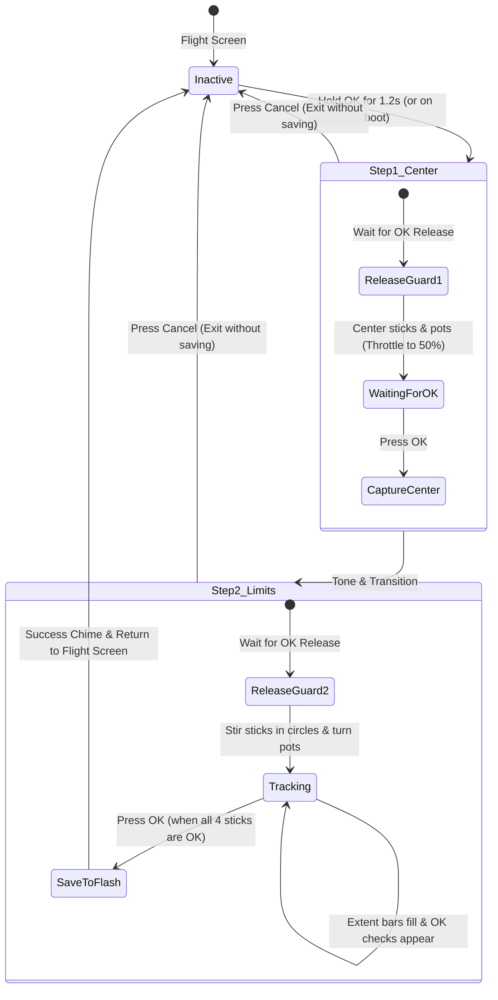

# Stick Calibration & Flash Persistence

Technical documentation for the interactive 2-step calibration wizard and the non-volatile Flash configuration storage on the FlySky FS-i6X.

---

## 1. Flash Storage Layout (`src/storage.rs`)

Configuration is stored in the last 2 KB page of the microcontroller's 128 KB internal Flash memory:
- **Flash Page Address:** `0x0801_F800` (Page 63 of STM32F072VB).
- **Page Size:** 2048 bytes.
- **Erase/Write Protocol:** Standard STM32 Flash unlock key sequence (`KEYR = 0x45670123`, `0xCDEF89AB`), page erase (`PER | STRT`), and halfword-aligned programming (`PG`).

### Configuration Structure (`RadioConfig`)

```rust
#[repr(C)]
pub struct ChannelCalib {
    pub min: u16,      // Minimum endpoint (raw ADC counts)
    pub center: u16,   // Neutral resting center (raw ADC counts)
    pub max: u16,      // Maximum endpoint (raw ADC counts)
    pub _pad: u16,     // 32-bit alignment padding
}

#[repr(C)]
pub struct RadioConfig {
    pub magic: u32,                // 0x4653_4B59 ("FSKY")
    pub version: u32,              // Config structure version (1)
    pub rx_id: u32,                // Persisted bound receiver ID
    pub sticks: [ChannelCalib; 4], // 0: Roll, 1: Pitch, 2: Throttle, 3: Yaw
    pub pots: [ChannelCalib; 2],   // 0: VRA, 1: VRB
}
```

- **Backward Compatibility**: If Flash contains a legacy 8-byte bind entry (`[magic, rx_id]`), the loader preserves the receiver ID and applies factory default stick spans.
- **Preservation on Save**: Updating stick calibrations preserves the currently bound `rx_id`, and binding a new receiver preserves existing stick calibrations.

---

## 2. Endpoint Calibration Wizard (`src/calib.rs`)

The calibration wizard provides an interactive on-screen workflow to measure the true physical limits of the transmitter gimbals and rotary dials:



---

## 3. Calibration Steps Explained

### Step 1 (Center)
1. **Key Release Guard**: When entering the wizard from the flight dashboard by holding `OK` for 1.2s, the wizard requires `OK` to be physically released before accepting input. This prevents accidentally skipping Step 1.
2. **Neutral Reference**: The user leaves Roll, Pitch, and Yaw spring-centered, manually positions the friction Throttle stick to the physical middle (50%), and centers VRA/VRB.
3. **Capture**: Pressing `[OK]` records `centers[0..5] = raw[0..5]` and initializes `mins` and `maxs` to the center reference.

### Step 2 (Limits & Margins)
1. **Dynamic Tracking**: The user moves both sticks in full circles touching all 4 corners, and rotates VRA & VRB from stop to stop.
2. **Real-Time Display**:
   - **Left side**: 4 stick gauges (`A`, `E`, `T`, `R`) show live position and covered travel from center. Once an axis has moved $\ge 250$ counts in both directions, its status changes from `--` to `OK`.
   - **Right side**: Live gauges for `V1` (VRA) and `V2` (VRB) with `OK` status indicators.
3. **Tolerance Margin Application**:
   When `[OK]` is pressed, the wizard applies OpenTX standard ~2% margin (`STICK_TOLERANCE = 64`):
   $$\text{effective\_min} = \text{center} - \frac{(\text{center} - \text{min}) \times 62}{64}$$
   $$\text{effective\_max} = \text{center} + \frac{(\text{max} - \text{center}) \times 62}{64}$$
   This ensures $\pm 100\%$ (and $0\% / 100\%$ for throttle) is reliably reached right at the gimbal bezel without straining the gimbal arms.
4. **Commit**: Updates active runtime calibration in `input::apply_calibration`, writes `RadioConfig` to Flash, plays the 2-tone success chime, and displays `CALIBRATION SAVED!`.

---

## 4. Operational Shortcuts

- **Hold `OK` for 1.2s** on the flight dashboard: launches calibration.
- **Hold `OK` during Power-On**: launches calibration immediately on boot.
- **Press `Cancel` (`ESC`)**: aborts calibration at any stage without changing saved values.
