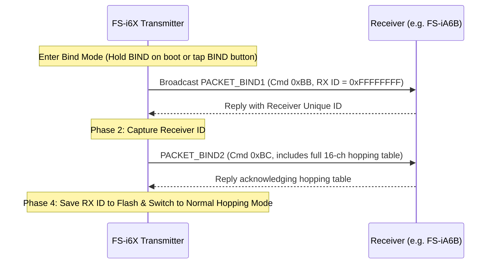

# AFHDS 2A Protocol & A7105 RF Driver

Technical documentation for the Amiccom A7105 2.4 GHz FSK transceiver driver and the FlySky AFHDS 2A (Automatic Frequency Hopping Digital System 2nd Gen) protocol implementation.

---

## 1. Hardware Interface

The A7105 transceiver is connected to the STM32F072VB via SPI1 and auxiliary control pins:

| Pin | Function | Description |
| :--- | :--- | :--- |
| `PB3` | **SPI1_SCK** | SPI Clock (up to 12 MHz) |
| `PB4` | **SPI1_MISO** | Data from A7105 |
| `PB5` | **SPI1_MOSI** | Data to A7105 |
| `PE12` | **CSN** | Chip Select (Active LOW) |
| `PB2` | **GIO2 (IRQ)** | Active LOW interrupt: TX complete / RX sync detected |
| `PE10` | **RF0** | TR Switch Control 0 |
| `PE11` | **RF1** | TR Switch Control 1 |

Implemented in [`src/rf/spi.rs`](../src/rf/spi.rs) and [`src/rf/a7105.rs`](../src/rf/a7105.rs).

### Antenna Diversity & TR Switching
- **TX Mode**: `PE10 = 0`, `PE11 = 1`
- **RX Mode**: `PE10 = 1`, `PE11 = 0`
- **Idle / Sleep**: `PE10 = 0`, `PE11 = 0`

---

## 2. Hopping Table Generation (FHSS)

AFHDS 2A hops across **16 unique radio frequency channels** spaced across the 2.400–2.483 GHz band. The channels are generated deterministically from the transmitter's unique 32-bit ID (derived by XOR-folding the 96-bit silicon UID at `0x1FFFF7AC`):

```rust
// Pseudo-random LCG hopping table generator
let mut seed = tx_id;
for i in 0..16 {
    seed = seed.wrapping_mul(214013).wrapping_add(2531011);
    let ch = (((seed >> 16) & 0x7FFF) % 160 + 1) as u8;
    // Ensures minimum 5-channel spacing between consecutive hops
    ...
}
```

Timing: The radio hops to the next channel in the table every **3.850 ms** ($259.74\text{ Hz}$), driven by the calibrated `TIM16` timer (`PSC = 47`, `ARR = 3849`).

---

## 3. Over-the-Air Packet Structure

All AFHDS 2A frames start with a 38-byte payload:

```
[0..3]   Transmitter ID (32-bit LE)
[4..7]   Receiver ID (32-bit LE, or 0xFFFFFFFF in Bind)
[8]      Packet Command Byte
[9..36]  Payload (Sticks, Settings, or Bind parameters)
[37]     Checksum
```

### Packet Types

| Command | Name | Description |
| :--- | :--- | :--- |
| `0x58` | **PACKET_STICKS** | Transmits 14 channels encoded as 16-bit microsecond pulse widths ($1000 \dots 2000\,\mu\text{s}$) |
| `0x56` | **PACKET_FAILSAFE** | Broadcasts failsafe pulse positions for all channels |
| `0xAA` | **PACKET_SETTINGS** | Configures receiver output modes (i-BUS, S.BUS, PWM, PPM) |
| `0xBB` | **PACKET_BIND1** | Transmits TX ID and prompts receiver for handshake |
| `0xBC` | **PACKET_BIND2** | Sends 16-channel hopping table and binds receiver ID |

---

## 4. 4-Phase Bidirectional Bind Sequence



### Two-Way Telemetry Receivers (FS-iA6B, FS-iA10B)
1. In Phase 1 (`0xBB`), the receiver replies with its 32-bit `rx_id`.
2. The transmitter captures the ID, transitions to Phase 3 (`0xBC`), sends the hopping table, and waits for receiver ACK.
3. Upon receiving ACK, the radio automatically commits `rx_id` to the active model profile, sounds a 2-tone confirmation chime, and transitions to normal hopping.

### One-Way Receivers (FS-A8S, Fli14, FS-iA6)
One-way receivers lack an RF power amplifier/transmitter and cannot send RF downlink packets back to the radio:
1. The transmitter broadcasts `0xBB` and `0xBC` continuously on the bind channel.
2. Once the receiver's LED turns solid (indicating it has locked onto the transmitter's ID and hopping table), the user presses **`[ESC]`** or taps the **`BIND`** button.
3. The transmitter immediately completes the bind process, saves the active configuration to Flash, and begins normal hopping transmission.

---

## 5. Model Match & Dynamic RX Switching

AFHDS 2A transmitters only filter telemetry downlink frames using the 32-bit `rx_id`. To support 20 independent models without receiver crosstalk:
- Each of the 20 `ModelConfig` profiles stores an independent `rx_id`.
- When the user selects a new model in `MODEL SELECT`, the menu controller calls:
  ```rust
  rf::set_rx_id(storage.models[new_model_idx].rx_id);
  ```
- This dynamically updates the RF driver's active receiver filter in real time. Downlink telemetry frames are only accepted if they match the active model's bound receiver, preventing telemetry corruption or accidental cross-model commands.

---

## 6. Downlink Telemetry (i-BUS Telemetry)

Immediately following transmission of each stick packet, the A7105 is switched to RX mode for a short reception window (~1.2 ms):
- **RSSI**: Signal strength percentage ($0 \dots 100\%$).
- **RX Battery Voltage**: Receiver bus voltage parsed from incoming telemetry frames, displayed as `RX: X.XXV` on the flight dashboard.
- **Lost Packet Counter**: If no valid telemetry packets are received for $> 52$ consecutive frames (~200 ms), telemetry is marked disconnected.
